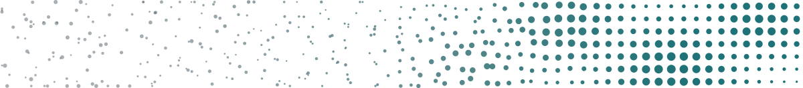

::::: {.column-page .home-top}

:::: {.home-main}

::: {.home-hero}

```{=html}

```

[I'm an ML/AI engineer at an AI startup, building generative AI products.]{.home-lead}

[This site is where I keep up with research on the side: notes on image generation, from the fundamentals to recent papers and small experiments.]{.home-sub}

:::

[Recent notes]{.section-eyebrow}

::: {#recent-notes}
:::

[[All notes →](notes.qmd)]{.note-more}

::::

:::: {.home-kinds}

[How the notes are organized]{.section-eyebrow}

::: {#note-kinds}
:::

::::

:::::
