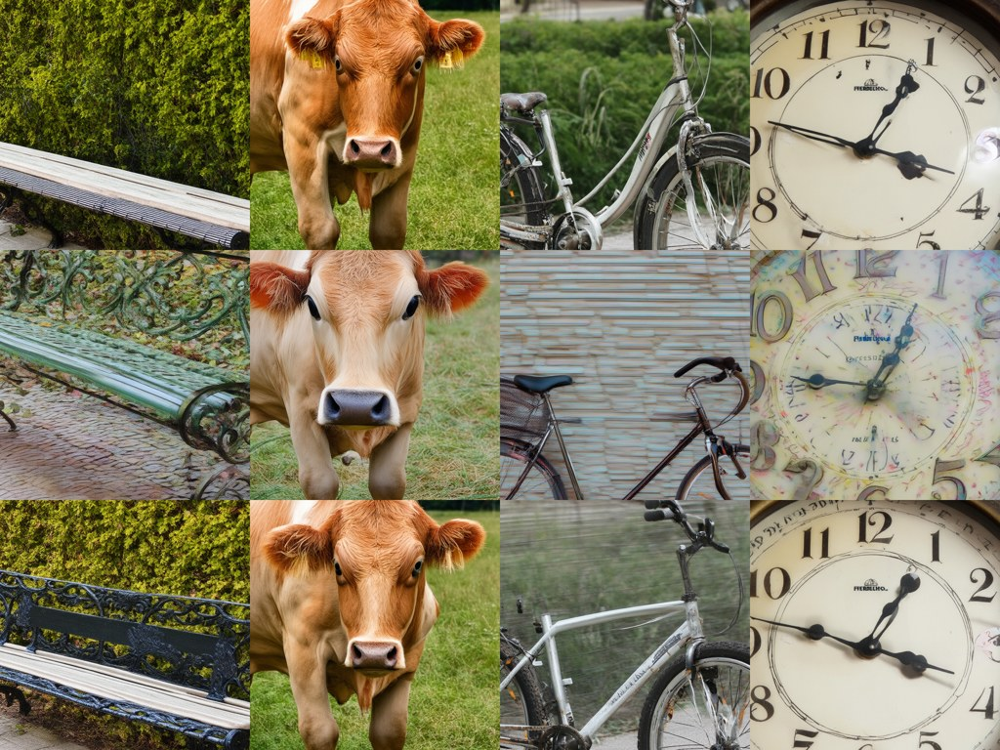
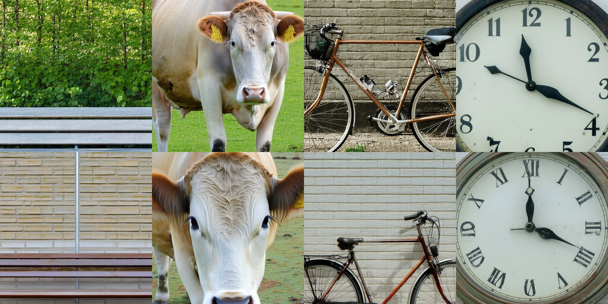

> CFG-MP (ICML 2026) reports that a projection step before each sampling update lifts SD3.5's GenEval score by three points at 60 function evaluations, raises HPSv2 and ImageReward, and makes the method less sensitive to the guidance scale. I re-ran it on SD3.5-Medium and Large from the same noise as CFG, at the same budget, with paired bootstrap intervals. With the released demo settings none of the three holds. What moves the scores is the number of sampling steps, and at 20 steps the method beats CFG on preference scores only by spending twice the budget.

Paper: Jian-Feng Cai, Haixia Liu, Zhengyi Su and Chao Wang, *Improving Classifier-Free Guidance of Flow Matching via Manifold Projection*, ICML 2026 — [arXiv:2601.21892](https://arxiv.org/abs/2601.21892). Re-evaluation preprint: *Revisiting Classifier-Free Guidance Methods in Latent Diffusion Models* — [arXiv:2608.16786](https://arxiv.org/abs/2608.16786). Code, per-image scores, bootstrap tables, figures and review records: [gs3393/cfgmp-sd35-eval](https://github.com/gs3393/cfgmp-sd35-eval).

## Two papers, one benchmark

CFG-MP (ICML 2026) reformulates classifier-free guidance as an optimization with a manifold constraint and adds a projection step before each sampling update. On Stable Diffusion 3.5 the paper reports GenEval rising from 58.36 (CFG) to 61.41 (CFG-MP+) at 60 function evaluations, HPSv2 and ImageReward at or above CFG-Zero* and Rectified-CFG++, and, from its DiT experiments, less sensitivity to the guidance scale.

Three months after that paper's revised arXiv version, a preprint titled *Revisiting Classifier-Free Guidance Methods in Latent Diffusion Models* (August 2026) measured eight CFG variants on SD3.5-Medium with paired prompt bootstraps and concluded that only a few nominal gains exceed the shared margin while resolved decreases occur across several methods and metrics. Its GenEval number for CFG is 0.655; APG, the best of the prediction-level variants, sits at 0.671, inside a ±0.027 margin, and the one GenEval gain that clears the margin belongs to SAG, an attention-perturbation method, at +0.060. CFG-MP is not among the eight, and the preprint does not measure preference scores.

So the two papers do not literally contradict each other. One measures a method the other never ran. What I wanted to know was simple: if CFG-MP is put on the same model, with the same noise, the same budget and the same kind of error bar, does the improvement survive? I ran it on SD3.5-Medium and, because the paper never says which SD3.5 it used, on SD3.5-Large as well.

## What the method does

CFG-MP inserts a fixed-point iteration before each Euler step. Starting from the current latent, it takes a half-step backward along the unconditional velocity, then a half-step forward along the conditional velocity, and repeats this K times (in the first steps, while the noise level is at or above 0.95, the two half-steps are taken in the opposite order); the paper argues the iterate converges toward a point where the conditional and unconditional predictions agree, and the ordinary CFG update is then taken from that point. CFG-MP+ wraps the same iteration in Anderson mixing so that it converges in fewer rounds.

Each projection round costs two extra forward passes. The authors' demo script uses 10 sampling steps, K = 3, and applies the projection only while the noise level is above 0.6, which comes to 62 forward passes per image. That budget matters for everything below: CFG with 30 Euler steps costs 60, so the two are compared at the same price.

One detail of the code turns out to matter later. Anderson mixing needs at least two previous iterates. With K = 1 there is nothing to mix, and CFG-MP+ reduces exactly to a single plain projection step, that is, to CFG-MP.

## Setup

- Models: SD3.5-Medium and SD3.5-Large, bfloat16, 1024², guidance scale 4 as in the paper's GenEval table.
- Prompts: all 553 GenEval prompts, 4 images each. Every setting starts from the same initial noise for a given prompt and image index, so differences are paired at the image level.
- Metrics: GenEval (the original detector-based evaluator, unmodified), HPSv2 (v2.0) and ImageReward v1.0 on the same images. All three are macro averages over the six GenEval tasks.
- Error bars: 10,000 paired bootstrap replicates, resampling prompts within each task and applying the same draw to every setting, as in the re-evaluation preprint. I report per-pair 95% intervals of the difference; the preprint pools the centered differences across methods into one shared margin, so the two rules are related but not identical. An interval that excludes zero is called *resolved* below and is marked with an asterisk in the tables; one that contains zero is left unresolved, not read as equality.
- Baselines: CFG at 30 steps, CFG-Zero* and APG with the hyperparameters the preprint's harness tuned on Medium (for Large I kept CFG-Zero* at the paper's w = 4 and dropped APG).
- The port of CFG-MP was checked against the authors' unmodified sampler: same seed, pixel-identical output for both variants.

Medium ran on one RTX A6000 for about 77 GPU-hours, Large on three H100s for about 19 hours, 44,240 images in total.

Code, per-image scores, bootstrap tables, figures and the review records are in [gs3393/cfgmp-sd35-eval](https://github.com/gs3393/cfgmp-sd35-eval).

## Result 1: the GenEval gain does not appear

| GenEval minus CFG, w = 4 | Medium | Large |
|---|---|---|
| CFG-MP+ | −0.0025 [−0.022, +0.017] | +0.007 [−0.009, +0.024] |
| CFG-MP (no Anderson) | −0.013 [−0.034, +0.007] | +0.011 [−0.007, +0.028] |

The paper's +3.05 points lies outside both intervals. CFG itself scores 0.683 on Medium and 0.714 on Large in this setup, ten points above the paper's 58.36, a gap consistent with a different model variant, resolution or evaluator, none of which the paper states.

Against CFG-Zero* the answer depends on the model. On Large, CFG-MP+ minus CFG-Zero* is +0.007 [−0.010, +0.023]. On Medium, CFG-Zero* at the harness's tuned w = 3.5 lands resolved below CFG itself (−0.024 on GenEval, and below on both preference scores), so CFG-MP+ does come out resolved above it there on GenEval (+0.022 [+0.003, +0.041]) and ImageReward (+0.074), while staying below it on HPSv2 (−0.50). That is the one pairing in which the paper's claim of beating CFG-Zero* holds, and it holds because the baseline fell, not because the method rose. The preprint did not find CFG-Zero* below CFG on GenEval; I have not isolated why. APG stays inside its interval on all three metrics on Medium; on GenEval that matches the preprint.

Per task the changes go both ways. On Medium, counting rises by 0.04 and position by 0.02, but two-object falls by 0.04 and colors by 0.02. The paper singles out counting, color attribution and spatial positioning as where CFG-MP helps; on Medium counting and position do move that way, color attribution barely (+0.002), and two-object and colors cancel them.

## Result 2: preference scores move the other way

| minus CFG | Medium HPSv2 | Medium ImageReward | Large HPSv2 | Large ImageReward |
|---|---|---|---|---|
| CFG-MP+ | −0.73 [−0.78, −0.68]\* | −0.046 [−0.078, −0.014]\* | −0.28 [−0.33, −0.24]\* | −0.015 [−0.040, +0.010] |
| CFG-MP | −0.84\* | −0.069\* | −0.37\* | −0.002 |

The paper's SD3.5 tables report CFG-MP+ above CFG by 0.4 to 1.1 HPSv2 points and 0.01 to 0.13 ImageReward on DrawBench and Pick-a-Pic prompts. Here, on GenEval prompts, HPSv2 is resolved in the opposite direction on both models, and the intervals are narrow.

Looking at the images shows one difference. With the demo settings, backgrounds and flat surfaces keep a fine noise texture and small color blotches. GenEval, a detector-based test of objects, counts, colors, positions and attribute binding, is not designed to score surface texture; whether the texture accounts for the HPSv2 gap is something I did not measure.

On Large the texture is much fainter, and the HPSv2 gap is also smaller.

## Result 3: raising the guidance scale

The paper's claim about scale sensitivity comes from its DiT/ImageNet experiments at ω between 1.5 and 2.5; on SD3.5 it reports w = 3 and 4 only. I swept w over 3, 5, 7, 9 and 12 with one image per prompt, CFG at 30 steps against CFG-MP+ at the demo settings.

| w | Medium ΔGenEval | Medium ΔHPSv2 | Large ΔGenEval | Large ΔHPSv2 |
|---|---|---|---|---|
| 3 | −0.020 | −0.92\* | +0.012 | −0.32\* |
| 5 | −0.001 | −0.61\* | −0.003 | −0.32\* |
| 7 | 0.000 | −0.64\* | −0.051\* | −0.55\* |
| 9 | −0.095\* | −1.18\* | −0.035 | −0.80\* |
| 12 | −0.215\* | −2.21\* | −0.126\* | −1.13\* |

Because CFG-MP+ runs at its 10 demo steps and CFG at 30, the step count differs along with the method, so the sweep describes the demo configuration rather than the projection at equal steps. At w = 12 on Medium, CFG-MP+ scores 0.461 on GenEval against CFG's 0.677. Whatever the projection does at low scales, at these settings it collapses earlier than plain CFG as the scale grows. This does not contradict the DiT result in the paper, which is a different model and a different scale range, but it is the opposite of what the abstract leads a reader to expect on SD3.5.

## What actually moves the number

Three things differ between "10 steps, K = 3, Anderson" and any other configuration I could run: the number of sampling steps, the number of projection rounds, and whether Anderson mixing is on. I ran settings that change one at a time.

| Change (everything else fixed) | Medium HPSv2 / IR / GenEval | Large HPSv2 / IR / GenEval |
|---|---|---|
| Steps 10 → 20 (K = 3, Anderson; 62 → 124 NFE) | +0.91* / +0.160* / +0.034\* | +0.47* / +0.054* / +0.007 |
| Rounds 3 → 1 (10 steps, plain; 62 → 34 NFE) | +0.15* / −0.011 / +0.008 | −0.01 / −0.052* / −0.012 |
| Anderson vs plain (10 steps, K = 3) | +0.11* / +0.023* / +0.011 | +0.08* / −0.013* / −0.003 |

Of the three changes I tried, the step count moved the scores by far the most. Doubling it moves HPSv2 by almost a point on Medium and half a point on Large; the other two knobs stay under 0.15 and change sign between models or metrics. Cutting the projection rounds from three to one, which halves the cost, even improves HPSv2 on Medium, though it lowers ImageReward on Large (−0.052).

Doubling the steps also doubles the price. At 20 steps and K = 3 (124 NFE) CFG-MP+ does beat CFG at 30 steps on every metric on Medium (GenEval +0.032, HPSv2 +0.18, ImageReward +0.115, all resolved) and on the two preference scores on Large. I did not run CFG at 62 steps, so I cannot say whether that is the method or the budget. The closest thing to a fair comparison I have is a plain projection at 20 steps with one round per step, 68 NFE against CFG's 60: GenEval +0.002 on Medium and +0.007 on Large, both unresolved; ImageReward +0.042 resolved on Medium, HPSv2 +0.05 resolved on Large, and nothing else. Unresolved is not a tie, the two costs are not identical either, and the honest summary is that the GenEval difference stays unresolved while two preference metrics show a small positive difference.

## What the paper's appendix says about steps

The paper's main SD3.5 tables give only "(cfg=4, NFE=60)" and, in the other table, ω of 3 and 4 with NFE of 60 and 100. They do not say how many sampling steps that is, how many projection rounds, or which SD3.5. The appendix has more. An ablation table runs SD3.5 at 20 and 30 steps (without stating the rounds); a sensitivity table varies K over 3, 4 and 5 (without stating the steps); and the ablation over projection rounds, measured in HPSv2 and ImageReward, says the authors "recommend setting FPI = 2 in practice". The 10-step, three-round setting I have been calling the demo defaults is what the released `demo_SD.py` does, and it is not obviously what produced the paper's tables.

That changes how I read my own numbers. At the demo defaults the method does not reproduce the paper's gains over CFG on SD3.5. At 20 steps with K = 3 it does better than CFG on preference scores, but that is twice the budget. The question the paper leaves open, and that I could not close, is whether the method wins at equal cost once the steps are set the way the authors actually set them.

## Two things that went wrong before any image was scored

Both are worth a paragraph because either one would have wrecked every GenEval number above; HPSv2 and ImageReward come from separate models and were not affected.

The re-evaluation harness installs mmdet 3.3 but downloads GenEval's Mask2Former checkpoint from the mmdet 2.0 release. The 3.x loader drops the decoder weights on a key mismatch and continues without raising; the detector then returned no detections at all on the mmdetection demo photo. The official 3.0 re-keyed checkpoint of the same training run fixes it.

On the H100, the prebuilt mmcv 2.2.0 wheel has no deformable-attention kernel for that GPU. The op prints an error string, returns zeros and does not raise; on a smoke test of sixteen images that the fixed evaluator scores 16 of 16, the broken path scored 4. The evaluator now compares the kernel against mmcv's PyTorch reference on a small input at startup and falls back to the reference when they disagree. To make sure the two scoring paths agree, I scored the same 2,212 Medium images with both on the A6000: identical verdicts on all of them, differing only in box coordinates.

The lesson is dull but I keep relearning it: before scoring anything, score an image whose answer you already know.

## Limits

- Everything here is the released demo configuration and three variations of it. I did not search CFG-MP's hyperparameters and did not run the recommended two rounds.
- The scale sweep is at 10 steps and one image per prompt; its GenEval intervals are about ±0.035 wide, and I did not repeat it at 20 steps.
- CFG at 62 steps, the budget-matched control for the 20-step runs, was not run. Neither were DPG-Bench, OneIG, or Rectified-CFG++.
- The texture in Figures 1 and 2 is a qualitative observation on four prompts; I did not quantify it.
- The scoring-path check compares two implementations on one GPU; H100 versus A6000 numerics were not compared directly.
- The paper does not state which SD3.5 variant or resolution it used, so nothing here shows that the paper's own experiment is wrong. It shows what the released code does at a matched budget.
