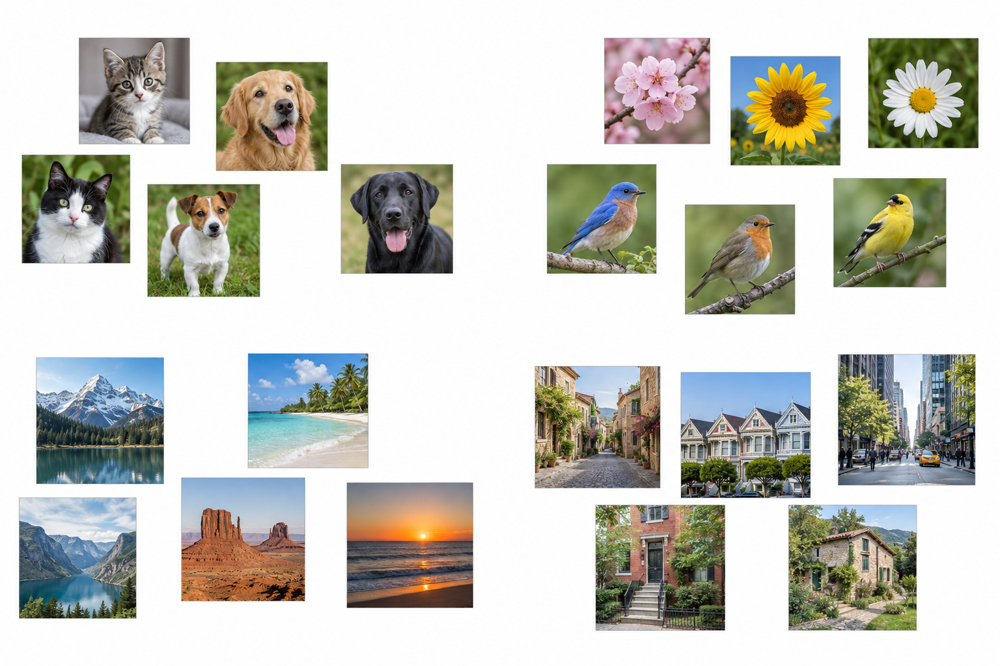
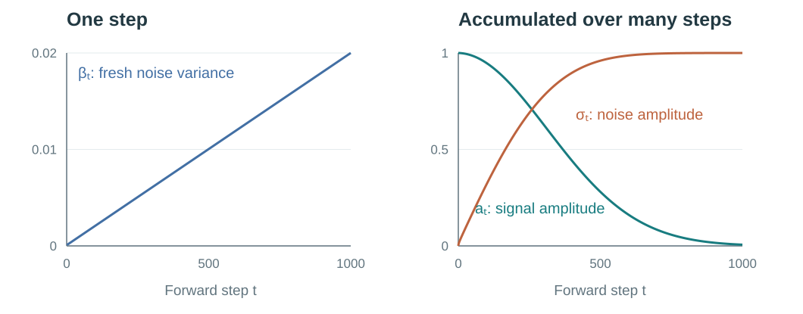
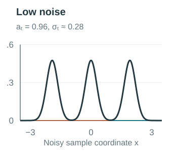
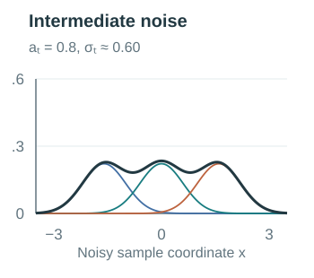
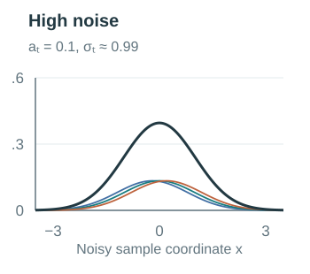
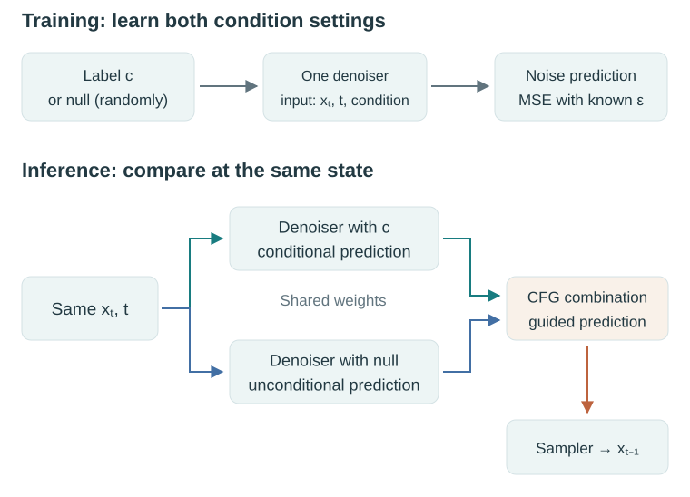
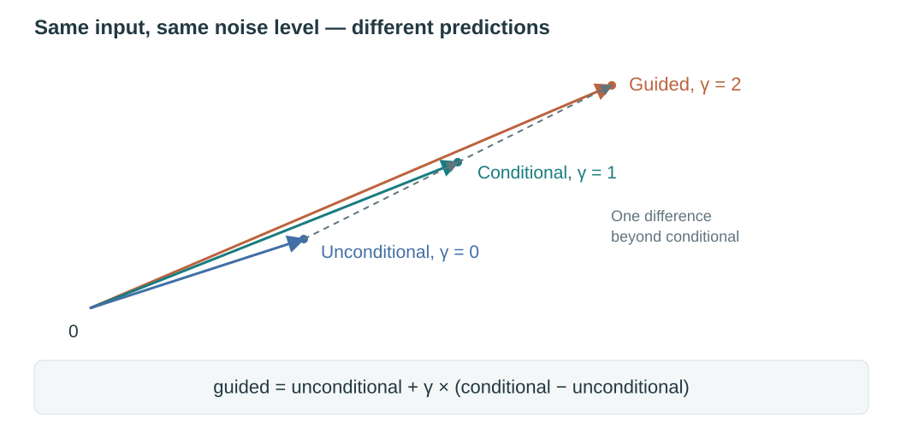
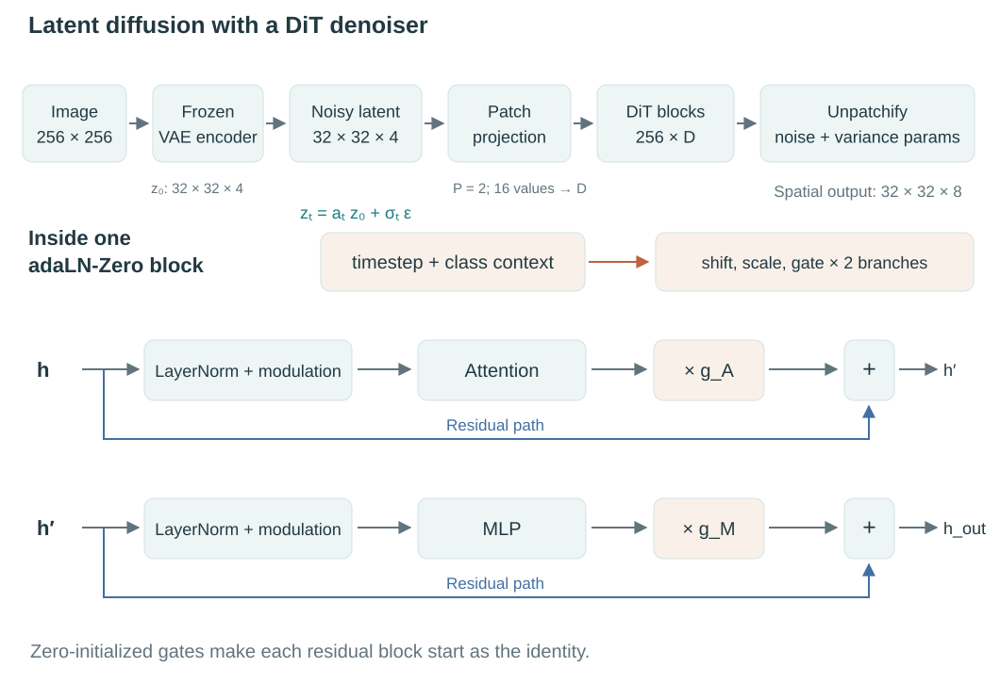

## Why I am writing this

I am writing this note to fill gaps in concepts that have remained uncertain and to rebuild my intuition for research in image generation. DDPM, score functions, classifier-free guidance, and Diffusion Transformers often appear together in a model, yet understanding each name separately does not automatically make their connections clear.

The question I want to follow is: **how does learning to predict noise become a way to generate an image, and where do guidance and the Transformer enter that process?**

This is a study note that follows that question across several papers. We will begin with the overall process, derive the mathematics that makes training possible, and then assemble a class-conditional DiT generator. The equations use a single notation throughout. The first overview needs only the idea of a neural network trained from examples; the later sections introduce the probability and calculus as they become useful.

## What a diffusion model is trying to learn

An image dataset contains many individual examples. Across them, there are recurring structures: objects have characteristic shapes, scenes have spatial relationships, and appearances vary with viewpoint, lighting, and context. A generative model aims to learn a distribution from which it can produce new examples with similar structure and variation.

{#fig-image-distribution fig-alt="Small photographs of animals, flowers, birds, landscapes, and buildings scattered in loose groups on a white background."}

Thinking in terms of a distribution changes the goal. We want a procedure that can produce many plausible images, including different examples under the same condition. A single average image would not achieve that.

Diffusion builds such a procedure around a deliberately easy operation: **corrupt an image by adding a known amount of random noise**. Repeating this operation gradually obscures the image. After enough corruption, the result is close to Gaussian noise, which is easy to sample.

The difficult direction is the way back. A neural network learns from noisy examples at many corruption levels. In the DDPM formulation used here, it receives a noisy image and its noise level, and predicts the noise component used to construct that training example. The training target is available because we sampled the noise ourselves.

{#fig-noising fig-alt="Six images of a simple mountain scene progressively obscured by Gaussian noise, with a forward corruption arrow and a reverse generation arrow."}

A training iteration takes a real image, chooses a noise level, samples noise, constructs a noisy input, and adjusts the network to reduce its prediction error. Repeating this over the dataset teaches one network to work at many noise levels.

At inference time, generation starts from newly sampled Gaussian noise. Unlike during training, there is no real image available as a reference: the model has to generate one using what it learned. The network predicts a denoising direction, a sampling rule uses that prediction to take a step toward a less noisy state, and the process repeats. An image emerges from the whole sequence.

::::: {#fig-overview-algorithms}

:::: {.algorithm-pair}

::: {.paper-algorithm}

[**Algorithm 1** · Training: one iteration]{.algorithm-title}

**Given:** training images and a noise-prediction network.

1. Sample a **real image** from the dataset.
2. Choose a random noise level and draw Gaussian noise.
3. Mix the image and noise at that level.
4. Give the noisy image and its noise level to the network.
5. Compare the predicted noise with the **noise drawn in step 2**.
6. **Update the network weights** to reduce this error.

[Repeat with new images, noise levels, and noise draws.]{.algorithm-result}

:::

::: {.paper-algorithm}

[**Algorithm 2** · Inference: generate one image]{.algorithm-title}

**Given:** the trained network; no real reference image.

1. Start from **new Gaussian noise**.
2. **For** each noise level, from high to low:
   a. Predict noise from the current state and noise level.
   b. Use the prediction and the sampling rule to obtain the next, less noisy state.
3. **Return** the final image.

[The sample changes at each step; the network weights stay fixed.]{.algorithm-result}

:::

::::

Training and inference at a glance. These are high-level versions of the DDPM procedures: training updates the network from a known noisy example, while inference repeatedly updates a sample using the trained network.

:::::

Three parts of this process will become clearer as we go:

- **The diffusion formulation** defines the corruption process, training objective, and reverse transitions.
- **Guidance** combines predictions during generation to emphasize a condition.
- **The denoising network** computes those predictions. DiT implements this network with a Transformer.

The distinction lets us examine each part while keeping the complete generator in view. The probabilistic construction follows [DDPM](https://arxiv.org/html/2006.11239v2#S2).

## The forward process: from one step to any step

### One notation for the whole article

Let $x_0 \in \mathbb R^d$ be a clean data sample and $x_t$ its noisy version at discrete step $t \in \{1,\ldots,T\}$. We flatten image coordinates conceptually when writing vectors; the implementation can retain an image-shaped tensor.

We write $p_{\mathrm{data}}(x_0)$ for the data distribution, $q$ for the fixed forward process and its posteriors, and $p_\theta$ for the learned reverse model. The noisy data marginal will be called $q_t$. Later, $z_t$ will explicitly denote a VAE latent, so that a pixel image and its compressed representation do not silently share a symbol.

| Symbol | Meaning |
|:---|:---|
| $\beta_t$ | Variance of the fresh noise added at forward step $t$ |
| $\alpha_t=1-\beta_t$ | Squared signal multiplier for that one step |
| $\bar\alpha_t=\prod_{j=1}^{t}\alpha_j$ | Cumulative squared signal multiplier from step $0$ to $t$ |
| $a_t=\sqrt{\bar\alpha_t}$ | Cumulative signal amplitude |
| $\sigma_t=\sqrt{1-\bar\alpha_t}$ | Cumulative forward-noise standard deviation |
| $\xi_t$ | Independent Gaussian noise for one forward transition |
| $\epsilon$ | Aggregate Gaussian noise in a direct sample of $x_t$ |
| $\epsilon_\theta(x_t,t,c)$ | Network prediction of that aggregate noise; $c$ is an optional condition |
| $r_t$ | Reverse-transition variance when we hold it fixed |
| $s_t(x)$ | Exact score of the noisy data marginal |
| $\gamma$ | CFG scale in this article |

The two roles of noise need separate symbols. The one-step noise $\xi_t$ is newly drawn at each transition. The aggregate noise $\epsilon$ summarizes all the noise between $0$ and $t$ in a direct sampling formula. Also, $\sigma_t^2$ always means **forward marginal variance**, never reverse-transition variance.

### What a noise schedule controls

Choose $0<\beta_t<1$ and define

$$
q(x_t\mid x_{t-1})
=\mathcal N\!\left(\sqrt{\alpha_t}\,x_{t-1},\,\beta_t I\right),
\qquad
x_t=\sqrt{\alpha_t}\,x_{t-1}+\sqrt{\beta_t}\,\xi_t,
\quad \xi_t\sim\mathcal N(0,I).
$$ {#eq-forward-step}

The sequence $\{\beta_t\}_{t=1}^T$ is the **noise schedule**. The sequences $\alpha_t$ and $\bar\alpha_t$ describe the same choice in terms of the signal retained at one step and across all steps.

The square roots matter: multiplying a random variable by a coefficient multiplies its variance by the coefficient squared. Here, $\alpha_t+\beta_t=1$. If the input were already standard Gaussian, this operation would preserve that distribution. This does not make the original image distribution Gaussian; it explains the balance between attenuation and added noise.

The original DDPM experiments used $T=1000$ with $\beta_t$ increasing linearly from $10^{-4}$ to $0.02$. Even though $\alpha_t$ remains close to one at every step, its **product** can become very small. [DDPM §4 and Appendix B](https://arxiv.org/html/2006.11239v2#S4)

{#fig-schedule fig-alt="A linearly increasing beta curve and nonlinear cumulative signal and noise amplitude curves for 1,000 diffusion steps."}

At step 1000, $\alpha_{1000}=0.98$ still looks close to one. But this describes **only the last step**. The original image has been attenuated at every step, so its remaining signal depends on the product of all 1,000 factors:

$$
\bar\alpha_{1000}
=\alpha_1\alpha_2\cdots\alpha_{1000}
\approx4.04\times10^{-5}.
$$

As we will derive below, the original image is multiplied by $\sqrt{\bar\alpha_{1000}}\approx0.00635$, while the accumulated noise is multiplied by $\sqrt{1-\bar\alpha_{1000}}\approx0.99998$. After 1,000 steps, the image signal has almost entirely disappeared and the result is **essentially pure Gaussian noise**. The approximation is very close under the usual image scaling, although the signal coefficient is still slightly above zero.

### Why we can sample any timestep directly

Suppose training asks for an image at noise level 500. Do we have to create $x_1$, then $x_2$, and so on, all the way to $x_{500}$?

We can get there in one step. The reason is that all the noise added along the way can be combined into **one Gaussian noise term**. We only need to know how much of the original image remains and how strong that combined noise should be.

Start with just two steps. The first step gives

$$
x_1=\sqrt{\alpha_1}x_0+\sqrt{\beta_1}\xi_1.
$$

The second step shrinks this entire result and adds fresh noise. Substitute the expression for $x_1$:

$$
\begin{aligned}
x_2
&=\sqrt{\alpha_2}x_1+\sqrt{\beta_2}\xi_2\\
&=\sqrt{\alpha_2\alpha_1}x_0
  +\sqrt{\alpha_2\beta_1}\xi_1
  +\sqrt{\beta_2}\xi_2.
\end{aligned}
$$ {#eq-expanded-forward}

Read the last line as three pieces: the remaining original image, the noise from step 1 after it has also been shrunk, and the fresh noise from step 2.

The original image has been multiplied by $\sqrt{\alpha_1}$ and then $\sqrt{\alpha_2}$, leaving a total multiplier of $\sqrt{\alpha_1\alpha_2}$.

For the noise, use one fact: **adding independent Gaussian noises gives another Gaussian, whose variance is the sum of their variances**. Since $\xi_1$ and $\xi_2$ each have variance one per coordinate, the two noise terms have variances $\alpha_2\beta_1$ and $\beta_2$. Their total is

$$
\begin{aligned}
\alpha_2\beta_1+\beta_2
&=\alpha_2(1-\alpha_1)+(1-\alpha_2)\\
&=1-\alpha_1\alpha_2.
\end{aligned}
$$

So we can sample $x_2$ by drawing a single $\epsilon\sim\mathcal N(0,I)$:

$$
x_2=\sqrt{\alpha_1\alpha_2}\,x_0
+\sqrt{1-\alpha_1\alpha_2}\,\epsilon.
$$

We have replaced two separate noise draws and two transitions with one draw and one formula.

**The same pattern continues at every step.** To see why, suppose that after step $t-1$, the image multiplier is $\sqrt{\bar\alpha_{t-1}}$ and the combined noise has variance $1-\bar\alpha_{t-1}$ per coordinate.

At the next step, the image multiplier becomes

$$
\sqrt{\alpha_t}\sqrt{\bar\alpha_{t-1}}
=\sqrt{\bar\alpha_t}.
$$

The old noise is also multiplied by $\sqrt{\alpha_t}$, so its variance is multiplied by $\alpha_t$. The fresh noise is independent of it and contributes variance $\beta_t$. Calling the total noise variance per coordinate $V_t$, we get

$$
\begin{aligned}
V_t
&=\alpha_t(1-\bar\alpha_{t-1})+\beta_t\\
&=\alpha_t-\alpha_t\bar\alpha_{t-1}+(1-\alpha_t)\\
&=1-\bar\alpha_t.
\end{aligned}
$$ {#eq-forward-variance}

The first step already has this form, and one more step preserves it. That proves the pattern for every $t$: the image multiplier is $\sqrt{\bar\alpha_t}$, and all the accumulated noise is Gaussian with variance $1-\bar\alpha_t$. We can therefore draw it in one go:

$$
\boxed{x_t=a_t x_0+\sigma_t\epsilon
=\sqrt{\bar\alpha_t}\,x_0+\sqrt{1-\bar\alpha_t}\,\epsilon,
\qquad \epsilon\sim\mathcal N(0,I).}
$$ {#eq-direct-forward}

Equivalently,

$$
q(x_t\mid x_0)=\mathcal N(a_t x_0,\sigma_t^2 I).
$$

To create the noisy training example at step 500, look up $\bar\alpha_{500}$, draw one Gaussian tensor $\epsilon$, and apply @eq-direct-forward to $x_0$. There is no need to construct the preceding 499 states. This is the direct sampling formula in [DDPM, Eq. (4)](https://arxiv.org/html/2006.11239v2#S2).

Both procedures give the same **distribution of noisy images at the chosen timestep**. A fresh direct draw will not reproduce the exact pixels of a previously sampled multi-step trajectory. For training, we need a sample at a randomly chosen noise level, so this direct route gives exactly what we need.

### From individual corrupted images to a noisy distribution

So far, we have kept one original image $x_0$ fixed. Imagine corrupting it again and again, drawing fresh noise each time. We obtain a cloud of possible noisy versions around $a_t x_0$. The Gaussian $q(x_t\mid x_0)$ describes that cloud.

Now also change which original we draw. Each image contributes its own cloud, and the network encounters inputs from all of them. Their mixture is the **noisy data distribution** $q_t$. The randomness comes from both the choice of image and the noise added to it.

To make this visible, consider a toy dataset containing just three equally likely scalar values: $-2$, $0$, and $2$. At a fixed noise level, each becomes a Gaussian centered at $-2a_t$, $0$, or $2a_t$. The overall density is their average:

$$
q_t(x)=\frac13\left[q(x\mid x_0=-2)+q(x\mid x_0=0)+q(x\mid x_0=2)\right].
$$

:::: {#fig-noisy-mixture}
::: {.distribution-panels}
{fig-alt="Low noise: three narrow Gaussian components centered close to the three original values."}

{fig-alt="Intermediate noise: the Gaussian components broaden and overlap as their centers contract toward zero."}

{fig-alt="High noise: the centers are close to zero and the mixture is close to a standard Gaussian."}
:::

The same three originals at increasing noise levels. Thin colored curves are each original's contribution, including its weight of one third; the dark curve is their sum. Both the shrinking centers and the increasing noise spread matter. This is an analytic one-dimensional example, not an image embedding or a trained model.
::::

For a general data distribution, this weighted average becomes

$$
q_t(x)=\int q(x\mid x_0)\,p_{\mathrm{data}}(x_0)\,dx_0.
$$ {#eq-noisy-marginal}

The integral gathers the contributions of possible originals, weighted by how often they occur. At $t>0$, $q_t$ describes **noisy inputs at that particular time**. It is different from both the clean distribution $p_{\mathrm{data}}$ and the Gaussian around one known original. We will return to these same three originals when explaining what a denoiser learns.

## Learning the way back

### What is known during training?

If we know the Gaussian noise distribution, why do we need a network to predict noise? Knowing how to draw random values does not tell us which values were mixed into a particular input. The noisy image alone generally admits many possible combinations of an original and a noise draw.

During training, we create that combination ourselves. We choose an image, choose a timestep, draw a noise tensor, and construct $x_t=a_t x_0+\sigma_t\epsilon$. We keep the sampled $\epsilon$ as the target. The network receives $x_t$ and $t$; the clean image and target noise are available to the training procedure, rather than being extra denoiser inputs.

| Role | Training | Generation |
|:---|:---|:---|
| Current noisy state | Constructed from a known image and sampled noise | Initially random; later produced by the sampler |
| Denoiser input | $x_t,t$ | $x_t,t$ |
| Original image and target noise | Available to construct the loss | No reference original or ground-truth corruption noise |
| What changes | Network parameters $\theta$ | The current sample $x_t$ |

A condition such as a class label will be added later. The distinction above stays the same: training has a target, while inference uses the learned prediction to continue a trajectory.

### How does predicting noise teach generation?

The network predicts the noise used to construct a training input, and we compare that prediction with the sampled tensor using squared error. Repeating this over images, noise levels, and noise draws gives the familiar DDPM objective:

$$
\boxed{
\mathcal L_{\mathrm{simple}}
=
\mathbb E_{\substack{x_0\sim p_{\mathrm{data}},\,
t\sim\mathcal U\{1,\ldots,T\}\\
\epsilon\sim\mathcal N(0,I)}}
\left[
\left\|
\epsilon-\epsilon_\theta(a_t x_0+\sigma_t\epsilon,t)
\right\|^2
\right].
}
$$ {#eq-simple-loss}

The expectation describes what is averaged over. A minibatch gives a sampled estimate of this objective; repeated parameter updates reduce error across the training distribution. One iteration can sample $x_t$ directly using the forward formula. It does not need to generate a whole image or run through all earlier timesteps.

There is a generative reason for this target. DDPM constructs generation from small reverse transitions. We can express the mean of each transition using a noise prediction, so learning the noise also learns where the next reverse step should be centered. The route from likelihood to the training loss is:

::: {.concept-route}
High probability for real data → a tractable likelihood bound → matching reverse distributions → fitting their means → predicting noise.
:::

With a fixed reverse variance, the relevant Gaussian KL term becomes a weighted noise MSE. DDPM's simplified objective then changes the weighting of noise levels. That final choice is part of the training design; it is not an exact algebraic identity with the full likelihood bound. [DDPM §§3.2–3.4](https://arxiv.org/html/2006.11239v2#S3)

::: {.callout-note collapse="true" title="Derivation: from reverse distributions and the likelihood bound to noise MSE"}

Generation starts from $p(x_T)=\mathcal N(0,I)$ and follows a learned chain:

$$
p_\theta(x_{0:T})=p(x_T)\prod_{t=1}^{T}p_\theta(x_{t-1}\mid x_t).
$$

For now, use a learned mean and a fixed reverse variance:

$$
p_\theta(x_{t-1}\mid x_t)=\mathcal N\!\left(\mu_\theta(x_t,t),r_t I\right).
$$ {#eq-reverse-model}

The true reverse conditional $q(x_{t-1}\mid x_t)$ averages over unknown originals and need not be Gaussian for a finite step. Small forward steps motivate modeling the reverse transition by a Gaussian. During training, conditioning on the known $x_0$ gives a related posterior that is exactly Gaussian:

$$
q(x_{t-1}\mid x_t,x_0)
=\mathcal N\!\left(\widetilde\mu_t(x_t,x_0),\widetilde\beta_t I\right),
$$

with

$$
\widetilde\beta_t
=\frac{1-\bar\alpha_{t-1}}{1-\bar\alpha_t}\beta_t,
$$

$$
\widetilde\mu_t(x_t,x_0)
=
\frac{\sqrt{\bar\alpha_{t-1}}\beta_t}{1-\bar\alpha_t}x_0
+
\frac{\sqrt{\alpha_t}(1-\bar\alpha_{t-1})}{1-\bar\alpha_t}x_t.
$$ {#eq-posterior-mean}

Conditioning on $x_0$ makes this posterior tractable. During training, the clean example is known, so it supplies a target for the learned reverse transition. During generation, the model must operate using $x_t$ and $t$ alone. The Gaussian posterior comes from multiplying $q(x_t\mid x_{t-1})$ by $q(x_{t-1}\mid x_0)$ and completing the square; the algebra is in the appendix. [DDPM, Eqs. (6)–(7)](https://arxiv.org/html/2006.11239v2#S2)

We would like to assign high probability to real data under $p_\theta(x_0)$. Computing that probability requires integrating out the whole reverse trajectory. Introduce the known forward trajectory distribution $q(x_{1:T}\mid x_0)$:

$$
\log p_\theta(x_0)
=\log\mathbb E_{q(x_{1:T}\mid x_0)}
\left[
\frac{p_\theta(x_{0:T})}{q(x_{1:T}\mid x_0)}
\right].
$$

Because log is concave, Jensen's inequality gives a lower bound on log likelihood. Equivalently, it gives an upper bound on negative log likelihood:

$$
-\log p_\theta(x_0)
\le
\mathbb E_q
\left[
\log\frac{q(x_{1:T}\mid x_0)}{p_\theta(x_{0:T})}
\right]
=\mathcal L_{\mathrm{VLB}}(x_0).
$$

The right-hand side is the negative evidence lower bound. Factor the forward trajectory in reverse order, conditioned on $x_0$:

$$
q(x_{1:T}\mid x_0)
=q(x_T\mid x_0)
\prod_{t=2}^{T}q(x_{t-1}\mid x_t,x_0).
$$

Taking the expected log ratio now separates the bound into

$$
\begin{aligned}
\mathcal L_{\mathrm{VLB}}(x_0)
={}&
D_{\mathrm{KL}}\!\left(q(x_T\mid x_0)\,\|\,p(x_T)\right)\\
&+\sum_{t=2}^{T}\mathbb E_{q(x_t\mid x_0)}
D_{\mathrm{KL}}\!\left(
q(x_{t-1}\mid x_t,x_0)
\,\|\,
p_\theta(x_{t-1}\mid x_t)
\right)\\
&-\mathbb E_{q(x_1\mid x_0)}\log p_\theta(x_0\mid x_1).
\end{aligned}
$$ {#eq-vlb}

The first term compares the noisy endpoint to our Gaussian starting distribution. With a fixed schedule, it contains no trainable reverse-model parameters. The middle terms teach the reverse transitions. The last term handles reconstruction at the data endpoint.

Focus on an interior transition, $t\ge2$. Its target and prediction are both Gaussians. Holding $r_t$ fixed, the part of their KL that depends on the learned mean is

$$
\frac{1}{2r_t}
\left\|
\widetilde\mu_t(x_t,x_0)-\mu_\theta(x_t,t)
\right\|^2.
$$

The other Gaussian KL terms depend on the variances. They are constant with respect to the mean parameters under this assumption. Thus fitting reverse distributions produces a squared-error objective for the reverse mean. This connects a likelihood-based generative objective to an ordinary supervised regression problem.

**Writing the reverse mean as a noise prediction**

From @eq-direct-forward,

$$
x_0=\frac{x_t-\sqrt{1-\bar\alpha_t}\,\epsilon}{\sqrt{\bar\alpha_t}}.
$$

Substitute this expression into @eq-posterior-mean and collect coefficients:

$$
\widetilde\mu_t(x_t,x_0)
=\frac{1}{\sqrt{\alpha_t}}
\left(
x_t-\frac{\beta_t}{\sqrt{1-\bar\alpha_t}}\epsilon
\right).
$$

This suggests predicting $\epsilon$ and defining the model's mean through that prediction:

$$
\boxed{
\mu_\theta(x_t,t)
=\frac{1}{\sqrt{\alpha_t}}
\left(
x_t-\frac{\beta_t}{\sigma_t}\epsilon_\theta(x_t,t)
\right).
}
$$ {#eq-noise-mean}

Under this parameterization, the mean-dependent KL term becomes

$$
\frac{\beta_t^2}{2r_t\alpha_t(1-\bar\alpha_t)}
\left\|\epsilon-\epsilon_\theta(x_t,t)\right\|^2.
$$ {#eq-weighted-noise-loss}

We have reached a noise-prediction loss from the reverse-process likelihood bound. The coefficient varies with $t$. DDPM's widely used simplified objective drops these particular weights and samples timesteps uniformly:

This is the objective in @eq-simple-loss.

The simplified objective changes the relative importance of noise levels; it is not an algebraically identical rewriting of the full bound. The endpoint term in @eq-vlb also has its own likelihood treatment. DDPM reported better sample quality with the simplified weighting. [DDPM §§3.2–3.4](https://arxiv.org/html/2006.11239v2#S3)

The direct forward formula now has an immediate computational benefit. To evaluate one stochastic training term, we can jump straight from a clean sample to the selected noisy input.

:::

### Why does a denoising step add fresh noise?

The prediction determines the center of a distribution for the next state. An ancestral DDPM sampler draws the next state from that distribution:

$$
\begin{aligned}
\mu_\theta(x_t,t)
&=\frac{1}{\sqrt{\alpha_t}}
\left(x_t-\frac{\beta_t}{\sigma_t}\epsilon_\theta(x_t,t)\right),\\
x_{t-1}&=\mu_\theta(x_t,t)+\sqrt{r_t}\,\eta,
\qquad \eta\sim\mathcal N(0,I).
\end{aligned}
$$ {#eq-ddpm-update}

The first line uses the prediction and schedule to compute the reverse mean. The second samples around it. The reverse variance $r_t$ controls the spread of possible next states; its square root scales a standard Gaussian draw.

{#fig-reverse-step fig-alt="Two Gaussian curves with the same mean and different widths, with a sampled next state marked on the horizontal axis."}

Denoising describes the overall progression toward a less noisy distribution. Variety between generated images comes first from the random starting state $x_T$; the fresh $\eta$ has a different job. The mean $\mu_	heta$ is a conditional average over the originals that could explain $x_t$. In the three-value example, an observation lying between the clouds of $2$ and $0$ has a mean step that points between them. Keeping only the mean at every step would hand the next query a state that is less spread out than the noisy distribution $q_{t-1}$ the network was trained on, and repeated averaging would pull trajectories toward such in-between states. Drawing $\eta$ with the reverse variance $r_t$ keeps the state distributed like $q_{t-1}$, so the next prediction receives an input at the noise level it expects and can commit toward one of the plausible originals. This is what preserving the uncertainty about the next state means here. The fresh $\eta$ is a new random draw, separate from the forward noise used in training. The usual DDPM algorithm omits it at the final step. Samplers that drop the random term, such as DDIM, use a different deterministic update rule rather than the mean above. [DDIM](https://arxiv.org/abs/2010.02502)

We can also translate the same prediction into an estimate of a clean image:

$$
\widehat x_0(x_t,t)=\frac{x_t-\sigma_t\epsilon_\theta(x_t,t)}{a_t}.
$$ {#eq-clean-estimate}

At high noise levels this estimate is uncertain. The sampler uses the prediction to take a step, then asks the network again at the new state and lower noise level. Understanding this repeated prediction requires looking at what MSE learns when several originals could explain an input.

## The score: what noise prediction learns about a distribution

### Which noise should the network predict when several answers are possible?

Every training example comes with a particular target noise tensor. But the same noisy state could have arisen from different originals with different noise draws. A network that sees only $x_t$ and $t$ cannot distinguish those hidden histories.

Return to our three-value dataset. At $a_t=0.8$ and $\sigma_t=0.6$, suppose we observe $x_t=1$. Each original gives a different possible explanation:

| Possible original $x_0$ | Noise required: $(1-0.8x_0)/0.6$ | Probability of this original given $x_t=1$ |
|---:|---:|---:|
| $-2$ | $4.33$ | about $0.01\%$ |
| $0$ | $1.67$ | about $29.13\%$ |
| $2$ | $-1.00$ | about $70.86\%$ |

All three originals are equally likely before observing the noisy value. After seeing it, an original of $2$ is the most plausible, but $0$ remains possible. An original of $-2$ would require a much more extreme noise draw. The weights come from evaluating their corruption Gaussians at the observed value and normalizing the results.

MSE favors the probability-weighted average of these possible targets. Here that average noise is about $-0.22$. This gives the general result:

$$
\epsilon^*(x,t)=\mathbb E[\epsilon\mid x_t=x].
$$ {#eq-optimal-noise}

The star denotes the ideal predictor that minimizes the population MSE; a trained finite network approximates it. The average is over **possible original-and-noise combinations consistent with the observed input**, weighted by their conditional probabilities. It is not an average over all noise draws regardless of the input, and training does not explicitly enumerate these combinations.

### If Gaussian noise has mean zero, why not always predict zero?

Zero is the average before seeing any input. Observing $x_t$ changes which noise draws are plausible, as the example above shows. The denoiser can use this information to predict a conditional average with lower expected squared error.

There are two related averages here. The training objective averages errors over sampled images, timesteps, and noise draws. The function that minimizes that objective, at any given input, outputs the conditional average of its possible noise targets. This is how supervision on individual examples teaches a function defined over the noisy input distribution.

::: {.callout-note collapse="true" title="Derivation: why squared error selects the conditional mean"}

Let $m(x,t)=\mathbb E[\epsilon\mid x_t=x]$. For any prediction $f(x,t)$, expand the conditional mean squared error:

$$
\begin{aligned}
\mathbb E[\|\epsilon-f\|^2\mid x_t=x]
={}&\mathbb E[\|\epsilon-m\|^2\mid x_t=x]\\
&+\|m-f\|^2.
\end{aligned}
$$

The cross term vanishes because $\mathbb E[\epsilon-m\mid x_t=x]=0$. The first term does not depend on $f$, so the optimal predictor is

$$
\epsilon^*(x,t)=\mathbb E[\epsilon\mid x_t=x].
$$

Individual noise tensors are the supervised targets. Across the population, the regression function that minimizes MSE is their conditional mean. A finite, imperfectly trained network only approximates this optimum.

:::

### How does this become a score?

The score describes how log density changes when we move the current sample a little. At noise level $t$, it is

$$
s_t(x)=\nabla_x\log q_t(x).
$$

For an image, this is a vector with one component per input coordinate. It points locally toward increasing log density in the distribution of noisy images at that time. The derivative is with respect to the input $x$. Training instead uses $\nabla_\theta\mathcal L$ to change the network's parameters.

First imagine a single Gaussian cloud around a known original. A point to the right of its center has positive added noise. The density increases toward the left, so its score is negative. A point to the left has the opposite signs. For the full mixture, the score combines these directions using the same conditional weights as the noise-prediction example. Recall that example: $a_t=0.8$, $\sigma_t=0.6$, an observed value $x_t=1$, and three equally likely originals. Each original's cloud has its own center, its own required noise, and its own score at $x=1$:

| Original $x_0$ | Cloud center $a_t x_0$ | Required noise | Score of that cloud alone at $x=1$: $-(1-a_t x_0)/\sigma_t^2$ | Weight given $x_t=1$ |
|---:|---:|---:|---:|---:|
| $-2$ | $-1.6$ | $4.33$ | $-7.22$ | about $0.01\%$ |
| $0$ | $0$ | $1.67$ | $-2.78$ | about $29.13\%$ |
| $2$ | $1.6$ | $-1.00$ | $+1.67$ | about $70.86\%$ |

Within each row, the score is $-1/\sigma_t$ times the noise. Averaging the noise column with these weights gives about $-0.22$; averaging the score column with the same weights gives about $+0.37$. The mixture score is that weighted average of the individual clouds' scores.

This gives the connection:

$$
\boxed{
s_t(x)=-\frac{\epsilon^*(x,t)}{\sigma_t},
\qquad
s_\theta(x,t):=-\frac{\epsilon_\theta(x,t)}{\sigma_t}\approx s_t(x).
}
$$ {#eq-noise-score}

The minus sign reverses the direction of predicted noise, and $\sigma_t$ supplies the scale for that noise level. In the example above, with $\sigma_t=0.6$ and observed $x_t=1$, the conditional mean noise of about $-0.22$ becomes a score of $-(-0.22)/0.6\approx+0.37$: the mixture density is increasing to the right at $x=1$. The most plausible original, $2$, has its cloud centered at $1.6$, to the right of the observation, and its $71\%$ weight outweighs the pull of the cloud centered at $0$. Predicted noise points from a cloud's center out to the observation; the score points from the observation back toward the centers. Subtracting the predicted noise, not moving along it, is the direction of increasing density.

{#fig-score fig-alt="The density of the three-component Gaussian mixture above a plot of its score, with x equals one marked in both panels."}

In practice, the network produces a noise prediction and we multiply it by $-1/\sigma_t$ to obtain a score estimate. We do not need to evaluate the normalized density $q_t$ or differentiate it during inference. Gaussian denoising supplies the connection between the regression target and the density's derivative. [DDPM §3.2](https://arxiv.org/html/2006.11239v2#S3.SS2), [Score-based generative modeling](https://arxiv.org/abs/1907.05600)

::: {.callout-note collapse="true" title="Derivation: the score of a mixture is a posterior-weighted average"}

For one known original image, the corruption Gaussian has score

$$
\nabla_x\log q(x\mid x_0)
=-\frac{x-a_t x_0}{\sigma_t^2}.
$$

At a training sample $x=a_t x_0+\sigma_t\epsilon$, this equals $-\epsilon/\sigma_t$. That is the score of the Gaussian around one original. To obtain the score of the full noisy dataset, differentiate @eq-noisy-marginal:

$$
\begin{aligned}
\nabla_x\log q_t(x)
&=\frac{1}{q_t(x)}
\int p_{\mathrm{data}}(x_0)\,\nabla_x q(x\mid x_0)\,dx_0\\
&=\int q(x_0\mid x)\,\nabla_x\log q(x\mid x_0)\,dx_0\\
&=-\frac{1}{\sigma_t}\mathbb E[\epsilon\mid x_t=x].
\end{aligned}
$$

For this Gaussian corruption, differentiation and integration can be interchanged under the usual regularity conditions. Combining the result with @eq-optimal-noise yields @eq-noise-score for the optimal predictor.

:::

### Why does averaging not produce the same blurry image every time?

The average depends on the current input and noise level. Different initial random states lead to different predictions, and each sampling step changes the input to the next prediction.

At high noise, many very different originals may be plausible. In fact, the ideal clean estimate in @eq-clean-estimate is their conditional mean:

$$
\widehat x_0^{\,*}(x,t)
=\frac{x+\sigma_t^2s_t(x)}{a_t}
=\mathbb E[x_0\mid x_t=x].
$$

In the scalar example ($a_t=0.8$, $\sigma_t=0.6$, $x_t=1$, score $\approx+0.37$), this gives $\widehat x_0^{\,*}\approx(1+0.36\times0.37)/0.8\approx1.42$. The same number comes from weighting the originals directly: about $0.71\times2+0.29\times0\approx1.42$. The estimate lies between the two plausible originals, $2$ and $0$, and equals neither. For images, such an average can indeed look ambiguous or blurry. A diffusion sampler uses the prediction to construct another state, then makes a new prediction at a lower noise level. Ancestral DDPM also samples fresh randomness along the way. The whole trajectory produces the final image.

The update rule matters. Following the score uphill until reaching a density maximum would concentrate samples at peaks. Sampling the distribution requires the time-dependent dynamics, including their scaling and, for ancestral DDPM, their random terms. The continuous-time SDE and ODE connection is available in the appendix.

## Classifier-free guidance: using the difference a condition makes

### If the model already receives a condition, what does guidance add?

A conditional denoiser receives a label $c$, such as a dog breed, along with the noisy input and timestep. It learns a distribution appropriate to that condition. This distribution still includes varied poses, backgrounds, and less typical examples.

Guidance lets us strengthen the influence of features that distinguish the condition while sampling. The useful comparison is between what the model predicts **with and without the condition, at the same noisy state and timestep**.

In score language, this difference has a precise interpretation. Bayes' rule gives

$$
s_t(x,c)-s_t(x)=\nabla_x\log q_t(c\mid x),
\qquad s_t(x,c)=\nabla_x\log q_t(x\mid c).
$$ {#eq-bayes-guidance}

The right-hand side points toward changes that make the condition more likely according to an ideal classifier of noisy inputs. Read the other way, the conditional score is a sum of two parts: $s_t(x,c)=s_t(x)+\nabla_x\log q_t(c\mid x)$. The first part moves toward any plausible noisy image; the second moves toward images that look like $c$. Scaling the conditional prediction by itself would also scale the first part. Subtracting the unconditional prediction isolates the part that the condition changes, which is the part guidance amplifies. Classifier guidance uses an explicit classifier for that part. CFG obtains the same direction from the two denoiser predictions. [CFG §3](https://arxiv.org/html/2207.12598v1#S3)

### How can one network provide both predictions?

During training, we sometimes replace the condition with a learned null condition $\varnothing$. Examples with their labels retained teach conditional behavior; examples with labels dropped teach unconditional behavior. The network parameters are shared, and both kinds of examples use the same noise-prediction loss.

At inference, we evaluate that network twice for the same $x_t,t$: once with $c$ and once with $\varnothing$. The null input is familiar because it was part of training. The two evaluations can share a larger batch, but both predictions still have to be computed.

{#fig-cfg-evaluations fig-alt="A training path with random condition dropout, and an inference path branching into conditional and null evaluations of the same denoiser before a guided prediction and sampler."}

### What does the guidance scale change?

We keep the convention that $\gamma=1$ is ordinary conditional sampling:

$$
\boxed{
\epsilon_{\mathrm{guided}}
=\epsilon_\theta(x_t,t,\varnothing)
+\gamma\left[\epsilon_\theta(x_t,t,c)-\epsilon_\theta(x_t,t,\varnothing)\right].
}
$$ {#eq-cfg}

Starting at the unconditional prediction, move along the difference toward the conditional prediction. With $\gamma=0$ we stay at the unconditional prediction; with $\gamma=1$ we reach the conditional one; with $\gamma>1$ we continue beyond it. The result replaces the noise prediction in the sampler's mean update. The same combination works for scores because both predictions share the factor $-1/\sigma_t$.

{#fig-cfg fig-alt="Unconditional prediction at guidance scale zero, conditional prediction at scale one, and an extrapolated guided prediction at scale two."}

The original CFG paper writes $(1+w)\epsilon_{\mathrm{cond}}-w\epsilon_{\mathrm{uncond}}$. Its $w$ is the extra guidance beyond the conditional prediction, so $w=\gamma-1$ in this article. [CFG §3.2](https://arxiv.org/html/2207.12598v1#S3.SS2)

::: {.callout-note collapse="true" title="Details: condition dropout, Bayes' rule, and the guided score"}

The training condition is replaced with probability $p_{\mathrm{drop}}$:

$$
\widetilde c=\begin{cases}\varnothing,&\text{with probability }p_{\mathrm{drop}},\\c,&\text{otherwise}.\end{cases}
$$

The noise objective becomes $\mathbb E[\|\epsilon-\epsilon_\theta(a_t x_0+\sigma_t\epsilon,t,\widetilde c)\|^2]$.
Bayes' rule gives

$$
\log q_t(x\mid c)=\log q_t(x)+\log q_t(c\mid x)-\log p(c).
$$

Differentiating with respect to $x$ removes $\log p(c)$ and gives @eq-bayes-guidance. For exact scores at a fixed noise level,

$$
\begin{aligned}
s_{\mathrm{guided}}&=s_t(x)+\gamma[s_t(x,c)-s_t(x)]\\
&=\nabla_x\log\left[q_t(x)q_t(c\mid x)^\gamma\right].
\end{aligned}
$$

This identity describes a vector field at one noise level. It does not by itself establish that the final samples follow the analogous reweighted clean density. A practical sampler also uses approximate network predictions and finite steps.

:::

### Why not make guidance as strong as possible?

Extra guidance changes the distribution being sampled. Emphasizing condition-distinguishing features can produce more recognizable examples while reducing variety or making compositions more stereotyped. In the original CFG experiments, moderate guidance improved FID in some settings, while stronger guidance raised Inception Score and worsened FID. Scale is a sampling choice with a tradeoff, rather than a guarantee of monotonically improving quality.

::: {.callout-note collapse="true" title="Paper results: what the CFG quality–diversity tradeoff looks like"}

The CFG paper's ImageNet$64\times64$ experiment illustrates why scale needs interpretation. FID compares distributions of real and generated image features (lower is better). Inception Score rewards confident classifier predictions together with class diversity across generated samples (higher is better). For the setting with condition-drop probability $0.1$, its table reports:

| Scale in this note, $\gamma$ | Original paper's $w$ | FID ↓ | Inception Score ↑ |
|---:|---:|---:|---:|
| 1.0 | 0.0 | 1.80 | 53.71 |
| 1.1 | 0.1 | 1.55 | 66.11 |
| 2.0 | 1.0 | 12.60 | 170.10 |

: Selected results from the original CFG paper, Table 1. The table uses 50,000 generated samples per evaluation. {#tbl-cfg}

A little guidance improves FID in this setting. Stronger guidance greatly raises Inception Score while worsening FID. These metrics capture different aspects of generated samples; neither alone measures every aspect of quality, diversity, or condition adherence. The paper describes its strongly guided samples as showing less variety and more saturated colors alongside higher individual sample fidelity. This is an empirical tradeoff under those experimental settings, rather than a universal monotonic quality improvement. [CFG §4, Table 1](https://arxiv.org/html/2207.12598v1#S4)

:::

We now have a target for training, an interpretation of the prediction as a score, and a way to combine conditional and unconditional predictions. DiT supplies the network that computes those predictions.

## DiT: building the denoiser with a Transformer

### Where does diffusion happen?

The original DiT works on spatial latents from a pretrained, frozen VAE. A $256\times256\times3$ image is encoded as a $32\times32\times4$ latent. Training adds noise to that latent, and DiT learns to predict the noise. Generation starts from a random latent and ends by decoding the sampled latent into an image.

Using $\mathcal E$ for the encoder and $\mathcal D$ for the decoder,

$$
z_0=\mathcal E(x_0),\qquad z_t=a_tz_0+\sigma_t\epsilon,
\qquad \widehat x_0=\mathcal D(z_0).
$$

The encoder's sampling convention and latent scaling are absorbed into $\mathcal E$ here, with the inverse scaling included in $\mathcal D$. The same diffusion formulas now act on $z$ instead of pixels. Noise is added to the spatial latent **before patchification**, because the latent is where the diffusion process is defined. The forward corruption $q(z_t\mid z_0)$ has to be a fixed, known Gaussian so that $z_t$ can be sampled in closed form and the target $\epsilon$ is available; patchification is a learned projection inside the network, so noise added after it would not correspond to a fixed corruption of the latent. The reverse process runs in the same space: the sampler produces $z_{t-1}$ from $z_t$, and the network's output is unpatchified back to the latent shape before the next step or the final decoding. Patchification and unpatchification are the denoiser's input and output layers, not part of the diffusion process. The VAE determines the representation and reconstruction quality; DiT learns generation within that space. [Latent Diffusion Models](https://arxiv.org/abs/2112.10752), [DiT §3](https://arxiv.org/html/2212.09748v2#S3)

### How does a latent become Transformer tokens?

Divide the latent into non-overlapping patches of side length $P$. Each patch becomes one token. The patch's values are projected into a hidden vector of dimension $D$, and a positional embedding records its spatial location. For a latent with shape $H_z\times W_z\times C_z$,

$$
N=\frac{H_zW_z}{P^2},\qquad
\text{values per patch}=P^2C_z.
$$

For our $32\times32\times4$ latent:

| Patch side $P$ | Values per patch | Token count $N$ |
|---:|---:|---:|
| 2 | 16 | 256 |
| 4 | 64 | 64 |
| 8 | 256 | 16 |

A patch's input dimension and a token's hidden dimension serve different roles. With $P=2$, each 16-value patch is mapped to a $D$-dimensional vector, giving a token matrix of shape $256\times D$. Changing patch size changes how much spatial detail each token covers and how many tokens attention processes. The hidden width $D$ is a separate architecture choice. Here $D$ denotes width; the calligraphic $\mathcal D$ above denotes the decoder.

{#fig-dit fig-alt="Tensor shapes through VAE encoding, latent noising, patch projection, DiT blocks, and unpatchification, with the attention and MLP residual branches expanded below."}

### What do timestep and class information do inside a block?

The timestep tells DiT which noise level it is handling. The class tells it which conditional distribution to model. Their embeddings are added to form a context vector, $u=e_t(t)+e_c(c)$. In an adaLN-Zero block, a small network turns this context into feature-wise controls for the attention and MLP branches.

The **shift** moves normalized feature values, the **scale adjustment** changes their magnitude, and the **gate** controls how much the branch contributes to the residual update. These controls are shared across token positions within a block, while each token retains its own content and position.

One branch can be read as

$$
h_{\mathrm{next}}=h+g\odot\operatorname{branch}\!\left((1+m)\odot\operatorname{LN}(h)+b\right).
$$

Here $b,m,g$ are shift, scale adjustment, and gate; $\odot$ denotes elementwise multiplication. At initialization, the gate is zero, so $h_{\mathrm{next}}=h+0=h$. Attention and MLP weights can still be nonzero. As training changes the modulation parameters, the residual branches begin to contribute.

This makes conditioning part of how features are processed throughout the denoiser. The original paper compared condition tokens, cross-attention, adaLN, and adaLN-Zero; adaLN-Zero performed best among these choices at the tested budget and was used for the main scaling experiments. [DiT §3.2 and §5, Fig. 5](https://arxiv.org/html/2212.09748v2#S3)

::: {.callout-note collapse="true" title="Block equations: the two adaLN-Zero residual branches"}

For $h\in\mathbb R^{N\times D}$, each block's context network produces six $D$-dimensional vectors:

$$
(b_A,m_A,g_A,b_M,m_M,g_M)=F(u),\qquad
\operatorname{mod}(h;b,m)=(1+m)\odot\operatorname{LN}(h)+b.
$$

They are broadcast across tokens, and the block computes

$$
\begin{aligned}
h'&=h+g_A\odot\operatorname{Attention}(\operatorname{mod}(h;b_A,m_A)),\\
h_{\mathrm{out}}&=h'+g_M\odot\operatorname{MLP}(\operatorname{mod}(h';b_M,m_M)).
\end{aligned}
$$ {#eq-adaln}

The final linear layer producing the modulation parameters is zero-initialized, which makes the gates zero and each block initially an identity. The final output projection is also zero-initialized in the authors' [implementation](https://github.com/facebookresearch/DiT/blob/main/models.py). These choices do not set every attention or MLP weight to zero.

:::

### Why does DiT also predict variance?

Recall the reverse-step picture: the sampler needs both a center and a spread. Noise prediction supplies the center through the reverse-mean formula. Our earlier DDPM explanation fixed the spread $r_t$ in advance. The original DiT also learns parameters for a diagonal reverse variance, allowing that spread to depend on the current input and timestep.

After the Transformer blocks, a final normalization and projection produce patch outputs, and unpatchification restores the spatial grid. With four latent channels, DiT outputs eight channels: **four noise predictions and four reverse-variance parameters**. The latter describe sampling spread. They are distinct from both the sampled noise tensor and the fixed forward noise schedule.

Noise MSE supervises the noise output. Training the variance requires an additional objective that evaluates the reverse distribution, supplied by a variational-bound term. This is where the fuller likelihood derivation becomes useful again. [DiT §3.1](https://arxiv.org/html/2212.09748v2#S3), [Improved DDPM](https://arxiv.org/abs/2102.09672)

::: {.callout-note collapse="true" title="Implementation details: the variance loss and log-variance parameterization"}

DiT follows the learned-variance approach used in improved diffusion models. Noise prediction is trained by MSE, while a variational-bound term trains the variance. The paper applies a stop-gradient to the mean output inside the variance-bound term, and the released diffusion code detaches it accordingly, keeping that term from updating the mean prediction directly through its output. Shared network features still receive gradients through the variance prediction. [Improved DDPM §3.1](https://arxiv.org/abs/2102.09672), [DiT's diffusion loss implementation](https://github.com/facebookresearch/DiT/blob/main/diffusion/gaussian_diffusion.py)

For interior steps, the implementation parameterizes log variance using a per-coordinate output $v_\theta$:

$$
\ell_\theta
=f_\theta\log\beta_t+(1-f_\theta)\log\widetilde\beta_t,
\qquad
f_\theta=\frac{v_\theta+1}{2},
\qquad
\Sigma_\theta=\operatorname{diag}(\exp\ell_\theta).
$$

The output is interpreted as an interpolation parameter between two log-variance choices; the reference code does not clamp it to that interval. It also clips the posterior log variance at the endpoint to handle $\widetilde\beta_1=0$. Those are implementation details beyond the fixed-$r_t$ derivation, and explain why a learned variance needs a training signal beyond noise MSE.

:::

### What grows when we increase resolution or reduce patch size?

Larger images can create more latent tokens without changing the trainable weights of the Transformer. More tokens still require more work: each token passes through projections and MLPs, and attention compares token pairs.

At a fixed patch size and hidden width, doubling both latent spatial dimensions multiplies the token count by four. The two main kinds of computation then grow differently:

| Work per block | Approximate cost | Effect of four times as many tokens |
|:---|:---|:---|
| Tokenwise projections and MLPs | $O(ND^2)$ | About $4\times$ |
| Attention's token-pair operations | $O(N^2D)$ | About $16\times$ |

The total increase depends on their relative costs. A common estimate for one Transformer block is about $4ND(6D+N)$ FLOPs: the tokenwise part, roughly $24ND^2$, dominates while $N$ is much smaller than $6D$, and attention, roughly $4N^2D$, becomes comparable only when $N$ approaches $6D$. For DiT-XL, $D=1152$, so that crossover sits near $6900$ tokens. Quadrupling tokens from $256$ to $1024$ therefore multiplies the block cost by about $4\times(6D+4N)/(6D+N)\approx4.4$, close to the tokenwise factor. The paper's reported forward cost matches: DiT-XL/2 uses $118.6$ Gflops on the $32\times32\times4$ latent of a $256\times256$ image and $524.6$ Gflops on the $64\times64\times4$ latent of a $512\times512$ image, a ratio of about $4.4$. [DiT §5.1, Table 4](https://arxiv.org/html/2212.09748v2#S5) Halving patch size at fixed resolution also quadruples token count, while changing the input/output patch projections. Increasing depth or hidden width spends compute in another way, by enlarging the network itself.

::: {.callout-note collapse="true" title="Paper results: compute and sample quality in the original DiT experiments"}

The paper evaluates twelve combinations of model size and patch size at a common 400K-step training budget and finds lower FID as forward-pass compute increases across that family. Its longer-trained DiT-XL/2 reaches FID-50K 2.27 on class-conditional ImageNet $256\times256$ with CFG; the reported corresponding result without guidance is 9.62. The final score includes the training budget, VAE, sampler, and guidance configuration alongside the backbone. [DiT §5 and §5.1, Table 2](https://arxiv.org/html/2212.09748v2#S5)

:::

DiT fills the noise-prediction role introduced by DDPM: latent patches, attention, and context-dependent modulation produce the prediction used by the loss and sampler. The choice of backbone can change while this role stays recognizable.

## Putting the generator together

### One training iteration

The opening training algorithm now has concrete components: a frozen VAE supplies the latent, the forward formula supplies a noisy input and known target, condition dropout trains both CFG behaviors, and DiT predicts noise and reverse-variance parameters.

~~~python
# Encode: the VAE is fixed; only DiT is trained here.
image, class_label = sample_training_batch()
with no_grad():
    z0 = frozen_vae_encode_and_scale(image)

# Forward process: sample one timestep and construct its input directly.
t = sample_uniform_timesteps(batch_size, low=1, high=T)
epsilon = sample_standard_normal_like(z0)
zt = a[t] * z0 + sigma[t] * epsilon

# CFG training: sometimes remove the class condition.
condition = randomly_replace_with_null(class_label, p_drop)
epsilon_pred, variance_params = dit(zt, t, condition)

# Noise MSE teaches the denoiser; the VB term teaches reverse variance.
noise_loss = mean_squared_error(epsilon_pred, epsilon)
variance_loss = variational_bound_term(
    clean=z0, noisy=zt, timestep=t,
    detached_noise_prediction=stop_gradient(epsilon_pred),
    variance_parameters=variance_params,
)
update_dit_parameters(noise_loss + variance_weight * variance_loss)
~~~

Each batch contains sampled image–timestep–noise combinations. Their losses estimate the objective over the distribution, and the update changes $\theta$. The full generation trajectory is not unrolled: @eq-direct-forward gives $z_t$ from $z_0$ in a single step, so each iteration can draw any timestep and construct its input directly. That closed form, not the loss, is what lets training sample one timestep at a time. This is conceptual pseudocode; the variance-loss weighting and endpoint likelihood follow the chosen diffusion implementation.

### One generated image

There is no reference image to encode and no target noise to compare against. The class condition is available, the model weights are fixed, and the loop updates the latent:

~~~python
z = sample_standard_normal(latent_shape)

for t in range(T, 0, -1):
    # CFG: two predictions for exactly the same state and timestep.
    eps_cond, var_cond = dit(z, t, class_label)
    eps_null, _ = dit(z, t, null_condition)
    eps_guided = eps_null + guidance_scale * (eps_cond - eps_null)

    # Reverse transition: compute its center and sampling spread.
    mean = (z - beta[t] / sigma[t] * eps_guided) / sqrt(alpha[t])
    reverse_variance = decode_learned_variance(var_cond, t)
    if t > 1:
        z = mean + sqrt(reverse_variance) * sample_standard_normal_like(z)
    else:
        z = mean

image = frozen_vae_unscale_and_decode(z)
~~~

The prediction has the score interpretation derived earlier, but this sampler directly uses its noise form. CFG changes the mean update through the guided noise prediction. The conditional variance prediction determines the spread, and the VAE decoder is used once the latent trajectory is complete.

::: {.callout-note collapse="true" title="Reproduction notes: guidance channels and shorter sampling schedules"}

This pseudocode guides all four noise channels and uses the conditional variance without guidance. It traverses every step of the displayed schedule. A shorter, respaced sampler must construct transitions for the selected timesteps; skipping loop indices while retaining the original one-step coefficients does not preserve that process.

The released original DiT applies CFG to the first three of four noise channels in its reported configuration. Appendix A reports similar results with all four channels after changing the guidance scale. Reported evaluations use 250 DDPM sampling steps from a model trained with a 1,000-step schedule. These settings matter when reproducing its numbers. [DiT Appendix A](https://arxiv.org/html/2212.09748v2#A1), [reference implementation](https://github.com/facebookresearch/DiT/blob/main/models.py)

:::

### Reading the complete system

The VAE defines the representation. The forward process creates noisy training examples with known targets. MSE learns a noise-prediction function whose ideal output is a conditional average, and Gaussian corruption connects that average to the noisy distribution's score. DiT computes the prediction, CFG combines two condition settings, and the sampler uses those predictions to update the latent until it can be decoded.

When returning to the equations, I want to be able to locate each of these roles: what is sampled, what is known, what the network predicts, and which part of the system changes during training or generation.

## Appendix: optional mathematical connections

::: {.callout-note collapse="true" title="Beyond discrete steps: reverse-time SDEs and the probability-flow ODE"}

The same idea survives when the discrete forward process is described by an SDE,

$$
dx=f(x,\tau)\,d\tau+g(\tau)\,dW_\tau,
$$

where $\tau$ denotes continuous time. If its marginal density is $q_\tau$, the reverse-time SDE has drift

$$
f(x,\tau)-g(\tau)^2\nabla_x\log q_\tau(x),
$$

when integrated from larger to smaller $\tau$. The corresponding probability-flow ODE has drift

$$
f(x,\tau)-\tfrac12 g(\tau)^2\nabla_x\log q_\tau(x).
$$

With the exact score and suitable regularity, these constructions share the forward process's time marginals. Their individual paths differ. Approximate networks and numerical solvers introduce further differences. This is a useful connection to later ODE-based samplers: the learned score and the rule for integrating a trajectory are related but distinct choices. [Score-Based Generative Modeling through SDEs, §3 and §4.3](https://arxiv.org/abs/2011.13456)

:::

::: {.callout-note collapse="true" title="Derivation: completing the square for the Gaussian posterior"}

For $t\ge2$, let $y=x_{t-1}$. Conditioned on the clean image, the previous state and the next transition are

$$
q(y\mid x_0)=\mathcal N\!\left(\sqrt{\bar\alpha_{t-1}}x_0,
(1-\bar\alpha_{t-1})I\right),
$$

$$
q(x_t\mid y)=\mathcal N(\sqrt{\alpha_t}y,\beta_t I).
$$

Bayes' rule says the posterior is proportional to their product. Keeping only the terms that depend on $y$, its negative log density is

$$
\frac12\left[
\frac{\|x_t-\sqrt{\alpha_t}y\|^2}{\beta_t}
+
\frac{\|y-\sqrt{\bar\alpha_{t-1}}x_0\|^2}{1-\bar\alpha_{t-1}}
\right].
$$

The coefficient of $\|y\|^2$, or posterior precision, is

$$
A_t=\frac{\alpha_t}{\beta_t}
+\frac{1}{1-\bar\alpha_{t-1}}
=\frac{1-\bar\alpha_t}{\beta_t(1-\bar\alpha_{t-1})}.
$$

The linear coefficient in the completed-square form is

$$
b_t=
\frac{\sqrt{\alpha_t}}{\beta_t}x_t
+
\frac{\sqrt{\bar\alpha_{t-1}}}{1-\bar\alpha_{t-1}}x_0.
$$

Thus the covariance is $A_t^{-1}I=\widetilde\beta_t I$, and the mean is

$$
A_t^{-1}b_t
=
\frac{\sqrt{\alpha_t}(1-\bar\alpha_{t-1})}{1-\bar\alpha_t}x_t
+
\frac{\sqrt{\bar\alpha_{t-1}}\beta_t}{1-\bar\alpha_t}x_0,
$$

which recovers @eq-posterior-mean. At $t=1$, conditioning on $x_0$ fixes the previous state exactly, and the variance degenerates to zero. That is why the data-endpoint likelihood is handled separately in the variational bound.

:::

## Appendix: translating notation across the papers

| In this article | In the source papers |
|:---|:---|
| $a_t=\sqrt{\bar\alpha_t}$ | DDPM uses $\sqrt{\bar\alpha_t}$; CFG uses an $\alpha$ indexed by log-SNR for the cumulative signal amplitude. CFG's $\alpha$ is not our one-step $\alpha_t$. |
| $\sigma_t=\sqrt{1-\bar\alpha_t}$ | Cumulative noise standard deviation here. DDPM also uses a $\sigma_t$ symbol for a reverse standard deviation; we call its square $r_t$ to avoid a collision. |
| $s_t=\nabla_x\log q_t$ | Score of the noisy marginal. Some sources use $p_t$ for this marginal; our $p_\theta$ is reserved for the learned generative model. |
| $\gamma$ | CFG scale based at the unconditional prediction. The original CFG paper's conditional-based extra scale is $w=\gamma-1$. |
| $b,m,g$ | adaLN shift, scale adjustment, and residual gate. DiT's original notation uses some of the same Greek letters as the diffusion schedule; they are separated here. |
| $z_t$ | A noisy VAE latent. The diffusion formulas retain their form after replacing pixel-space $x_t$ with $z_t$. |

The CFG paper's log-SNR variable corresponds here to $\lambda_t=\log(a_t^2/\sigma_t^2)$. In this DDPM forward-time convention, $t$ increases while the signal-to-noise ratio decreases. Following generation backward through $t$ therefore increases log-SNR.

## References and figure provenance

- Jonathan Ho, Ajay Jain, and Pieter Abbeel. [Denoising Diffusion Probabilistic Models](https://arxiv.org/abs/2006.11239v2), 2020.
- Yang Song and Stefano Ermon. [Generative Modeling by Estimating Gradients of the Data Distribution](https://arxiv.org/abs/1907.05600v3), 2019.
- Yang Song et al. [Score-Based Generative Modeling through Stochastic Differential Equations](https://arxiv.org/abs/2011.13456), 2021.
- Jonathan Ho and Tim Salimans. [Classifier-Free Diffusion Guidance](https://arxiv.org/abs/2207.12598v1), 2022.
- Alex Nichol and Prafulla Dhariwal. [Improved Denoising Diffusion Probabilistic Models](https://arxiv.org/abs/2102.09672), 2021.
- Robin Rombach et al. [High-Resolution Image Synthesis with Latent Diffusion Models](https://arxiv.org/abs/2112.10752), 2022.
- William Peebles and Saining Xie. [Scalable Diffusion Models with Transformers](https://arxiv.org/abs/2212.09748v2), 2023. [Official code](https://github.com/facebookresearch/DiT).

The scattered-photo illustration was generated specifically for this draft with the built-in image-generation tool. Its images are synthetic. The other figures are original explanatory diagrams and analytic illustrations generated by the accompanying figure script. The noising panels are a computed forward process on a procedural image; the score plot uses a specified Gaussian mixture. They are not outputs from a trained diffusion model. Experimental numbers in the tables and discussion are attributed to the papers, rather than to experiments performed for this note.
