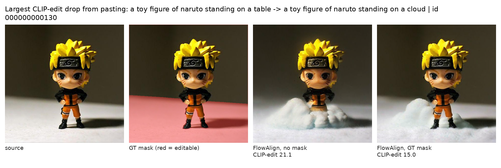
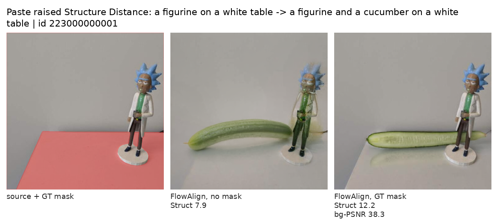
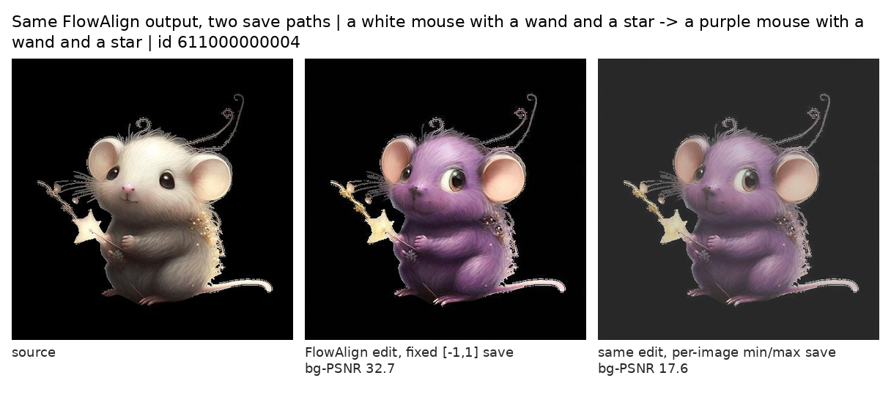

> The previous note ended by asking for a table in which every method gets the same mask. This is that table: five methods, three mask conditions, 151 PIE-Bench images on SD3.5-medium. The background columns shrink to a narrow band, a few differences survive, and the average rank depends on which condition and which columns you read. Along the way, one baseline row in the paper turned out to match what the method's official script does when it *saves* an image.

Paper: Desong Yang and Mang Ye, *DirectEdit: Step-Level Accurate Inversion for Flow-Based Image Editing*, ICML 2026 — [arXiv:2605.02417](https://arxiv.org/abs/2605.02417). Benchmark: Ju et al., *PnPInversion* / PIE-Bench — [arXiv:2310.01506](https://arxiv.org/abs/2310.01506). Per-image results, code, figures and review records: [gs3393/pie-bench-equalized-mask](https://github.com/gs3393/pie-bench-equalized-mask).

## Where the last note stopped

The previous note argued that DirectEdit's background-preservation score on PIE-Bench does not isolate its inversion contribution, because the method pastes the source latent back outside the edit mask. Holding the mask condition fixed across methods is a necessary control for comparing methods on that column; it is not, by itself, enough to isolate a component, which this note comes back to. I did not have that table. This note is that table.

The scope is the same as before and worth stating before any number: SD3.5-medium at 512², a 151-image subset of PIE-Bench stratified across its ten edit types, one seed per method, and the benchmark's ground-truth masks. Five methods: FTEdit, FlowEdit, FlowAlign, DNAEdit and DirectEdit — the five SD3.5 methods in DirectEdit's Table 1, which lists them in six rows because DirectEdit appears with and without its mask. Three conditions each. About 3.5 GPU-hours of generation, counting the two DirectEdit runs carried over from the previous note and excluding evaluation and the auxiliary checks. Per-image results, the runner scripts, the subset ids and the figures are in a [public repository](https://github.com/gs3393/pie-bench-equalized-mask).

## What "the same mask" means for five different methods

Each method carries a different variable through its loop, so "paste the source back" has to be defined per method. The rule I used: after each method's own update step, replace the carried latent outside the mask with *the source trajectory's latent at the same noise level*.

- DirectEdit, FTEdit and DNAEdit run in noise coordinates and keep a recorded inversion trajectory; they paste the recorded latent for that step.
- FlowEdit and FlowAlign carry a clean-coordinate latent that starts at the encoded source and accumulates the edit; they paste the encoded source itself.

What this equalizes is the spatial constraint and its preprocessing — the same ground-truth mask, dilated by 3 pixels and downsampled to 64×64 the way DirectEdit's code does it — not the intervention itself. Three methods restore their own inversion latent, two restore the encoded source, and each decodes through its own VAE path. Restoration is exact only where the processed latent mask is zero; dilation, bilinear downsampling and the decoder's receptive field mean that pixels just outside the annotation are not copied verbatim. The columns are comparable across rows because every row is scored by the same evaluator on the same annotation, not because the five methods end at an identical background.

The upstream code was not modified; each method's loop was copied into a runner (DirectEdit's is imported as-is) with one blending line added — and, because copying five codebases is never that clean, with a handful of other departures from the official scripts (resolution, dtype, a CFG-flag repair in one runner, per-image reseeding in three, the VAE encode mode, the output save path) that the report lists in full. These are adapted runs, not certified reproductions.

Two more conditions bracket the intervention. **No mask** is each method as adapted, with no pasting. **Pixel paste** takes the no-mask output and composites it with the source in pixel space using the same mask the evaluator uses. That last one is not a method; it is a constructed control. Restoring the reference pixels outside the evaluation mask fixes its background scores by construction, and it says nothing about editing quality or how natural the boundary looks.

## Three conditions, five methods

No mask:

| Method | Structure ↓ | bg-PSNR ↑ | bg-LPIPS ↓ | bg-MSE ↓ | bg-SSIM ↑ | CLIP-whole ↑ | CLIP-edit ↑ |
|---|---|---|---|---|---|---|---|
| FTEdit | 21.49 | 23.61 | 88.07 | 59.58 | 87.16 | 25.14 | 21.76 |
| FlowEdit | 24.48 | 22.86 | 90.80 | 74.75 | 85.73 | **27.52** | **24.02** |
| FlowAlign | **13.26** | **27.32** | **45.44** | **26.85** | **91.30** | 26.66 | 22.67 |
| DNAEdit | 14.25 | 26.48 | 71.39 | 33.05 | 89.91 | 26.45 | 22.94 |
| DirectEdit | 17.22 | 26.13 | 68.24 | 33.82 | 88.84 | 26.19 | 22.53 |

Everybody pastes the ground-truth mask:

| Method | Structure ↓ | bg-PSNR ↑ | bg-LPIPS ↓ | bg-MSE ↓ | bg-SSIM ↑ | CLIP-whole ↑ | CLIP-edit ↑ |
|---|---|---|---|---|---|---|---|
| FTEdit | 9.98 | 34.85 | 10.50 | 5.69 | **95.06** | 24.71 | 21.77 |
| FlowEdit | 14.26 | 33.58 | 12.48 | 6.83 | 94.57 | **26.63** | **23.94** |
| FlowAlign | 9.03 | 34.77 | 10.64 | 5.71 | 94.79 | 26.36 | 22.96 |
| DNAEdit | **7.72** | 34.72 | 10.60 | 5.72 | 94.85 | 25.79 | 22.80 |
| DirectEdit | 8.73 | **35.01** | **10.16** | **5.49** | 94.70 | 25.42 | 22.39 |
| no-edit reference | 0.55 | 35.77 | 9.28 | 5.10 | 94.94 | 23.47 | 20.23 |

What the columns measure matters for everything that follows. Structure Distance is the mean squared difference between DINO self-similarity matrices of the whole source and the whole edited image. The four background metrics zero the annotated edit region in both images and then score the whole frame, so PSNR and MSE keep the whole-frame denominator, which is why their absolute values run high. CLIP-whole scores the target prompt against the whole edited image; CLIP-edit scores it against the edited image with the pixels outside the annotation zeroed — the edited region without its real surround, but including whatever the method left inside the annotation near the boundary. Scales follow the paper's tables: Structure Distance and LPIPS ×10³, MSE ×10⁴, SSIM ×10². Background columns average the 120 images whose annotation leaves a background; the rest use all 151. The no-edit reference is the source encoded and decoded through DirectEdit's VAE path, scored by the same script — a reference, not a bound; FTEdit's SSIM lands above it.

Pixel paste makes every background column identical across the five methods to the last decimal (PSNR infinite, LPIPS and MSE zero, SSIM 99.998), leaves CLIP-edit exactly where the no-mask row had it, and orders Structure Distance as DNAEdit 7.89, FlowAlign 9.22, DirectEdit 9.86, FTEdit 10.44, FlowEdit 14.11.

## What compresses, and what does not

Between the no-mask and GT-mask tables, the spread of mean background PSNR across methods goes from 4.46 dB to 1.43 dB: four methods lie within 0.29 dB of one another, and FlowEdit sits 1.14–1.43 dB below those four. The other three background columns narrow on their own scales — LPIPS from a 45-point spread to 2.3, MSE from 48 to 1.3, SSIM from 5.6 to 0.5. Every method closes between 83% and 102% of its own distance to the no-edit reference on those four columns.

Compression is not erasure. Some pairwise differences survive an image-paired bootstrap: DirectEdit's background PSNR is 0.29 dB above DNAEdit's with a 95% interval of [+0.13, +0.46], and it is 1.43 dB above FlowEdit's. But the same comparison that was +2.52 dB against FTEdit without masks is +0.17 dB with them, interval crossing zero; and the DirectEdit–DNAEdit difference changes sign, from −0.35 dB without masks to +0.29 dB with them. These intervals are exploratory — pointwise, uncorrected for multiplicity, one seed — so read them as "detectable here," not as settled, and not as a statement about whether the difference is visible.

The three non-background columns keep between-method variation, and they shrink less, proportionally, than the four background columns: the spread across methods falls by about 42% for Structure Distance (11.2 to 6.5), about 19% for CLIP-whole (2.38 to 1.92), and about 4% for CLIP-edit (2.26 to 2.17). Differences on these columns are not comparable in size with one another or with the background columns. Averaged across all 151 images, pasting the mask changes CLIP-edit by between −0.15 (DNAEdit) and +0.29 (FlowAlign); individual images can lose five or six points, so this is a statement about means. Figure 1 is the largest single CLIP-edit decrease in the set, from 21.1 to 15.0, between FlowAlign runs without and with per-step blending. The two are separate generations, not one edit clipped by a mask: the masked run keeps more of the toy and renders the cloud differently. Which of those changes moved the score, the comparison does not isolate — CLIP-edit sees only the pixels inside the annotation in both conditions.

{fig-alt="Four panels: a toy figure on a table; the same image with the table region tinted red; FlowAlign's edit placing the toy on a cloud without mask blending; the edit with mask blending, where more of the toy is preserved and the cloud is rendered differently."}

Pasting also does things the averages hide. Figure 2 is a case where Structure Distance rose after the paste, from 7.9 to 12.2, while background PSNR reached 38.3 dB. The masked run preserves the figurine, which the unmasked run had distorted, but renders the cucumber differently, with a straight edge near the mask boundary. Which change drives the higher Structure Distance, the panels do not say. Structure Distance is not an editing-success score either: the no-edit reference — a VAE round-trip of the source, no edit at all — has the lowest mean of any condition, 0.55.

{fig-alt="Three panels: a figurine on a white table with the table region tinted red; FlowAlign's unmasked edit adding a cucumber and distorting the figurine; the masked edit preserving the figurine with a differently rendered cucumber and a straight edge near the mask boundary."}

## The ranking depends on which table you read

DirectEdit's Table 1 summarizes each method with an average of its per-metric ranks. With ties averaged, here is how the five methods order under each condition, alongside the paper's own SD3.5 rows for these five methods ranked the same way (its no-mask DirectEdit row left out):

| Table | 1st | 2nd | 3rd | 4th | 5th |
|---|---|---|---|---|---|
| Paper, Table 1 SD3.5 rows for the five methods (only DirectEdit masked) | DirectEdit 1.50 | DNAEdit 2.57 | FlowAlign 3.21 | FlowEdit 3.71 | FTEdit 4.00 |
| Nobody pastes | FlowAlign 1.43 | DNAEdit 2.29 | DirectEdit 3.14 | FlowEdit 3.86 | FTEdit 4.29 |
| Everybody pastes the GT mask | DirectEdit 2.43 | FlowAlign · DNAEdit 2.86 | — | FTEdit 3.00 | FlowEdit 3.86 |
| GT mask, background columns removed | FlowAlign · DNAEdit · FlowEdit 2.33 | — | — | DirectEdit 3.33 | FTEdit 4.67 |
| Pixel paste | DNAEdit 2.57 | FlowEdit · FlowAlign 2.71 | — | DirectEdit 3.29 | FTEdit 3.71 |

On this subset DirectEdit ranks third without masking and first under GT-mask blending, 0.43 mean-rank points ahead of the tied runners-up. It ranks fourth when the four background metrics are left out of the GT-mask ranking, and fourth again in the separate pixel-compositing condition — which changes the evaluated images, Structure and CLIP-whole included, as well as tying the background columns. That is a statement about sensitivity: the order depends on the mask condition and on how much weight the background columns carry. It is not a finding about *why* the paper's table orders the way it does — the paper used 700 images, MLLM-derived masks and the authors' own runs, and this experiment does not reproduce that setup. The earlier draft of this note said more than that, and an external audit made me take it back.

## What the alignment buys, as far as this table can say

The honest answer is that this table cannot isolate it. FTEdit is DirectEdit's code ancestor and the natural comparison, but it is not "DirectEdit minus alignment": the two differ in inversion scheme, in the AdaLN and attention injection ratios, in how the source branch is guided. With the mask equalized, DirectEdit's LPIPS, MSE and CLIP-edit are better than FTEdit's by amounts whose intervals exclude zero (−0.34, −0.20 and +0.62 on the paper's scales), its PSNR is not distinguishable (+0.17 dB), and its SSIM is worse (−0.35). Its mean background PSNR is 0.29 dB above DNAEdit's and 0.24 dB above FlowAlign's — the second interval includes zero — and its CLIP scores are below both. The comparison with FlowEdit runs the same way, only larger: +1.43 dB of PSNR, −1.55 points of CLIP-edit. These are comparisons between configured systems. Attributing any of them to alignment would take a component ablation in this SD3.5 setup with everything else held fixed; the paper's FLUX ablation illustrates that design but does not estimate these differences.

## One baseline row that does not look like the method

While building the no-mask table, agreement with the paper's SD3.5 rows varied by method and by metric: FTEdit and DirectEdit were close on most columns, DNAEdit and FlowEdit were off by more on some. FlowAlign stood out. The paper reports Structure 33.49 and background PSNR 24.06 for it — a Structure Distance worse than FlowEdit's 23.13, which is odd for a method whose own paper claims better preservation than FlowEdit. Running FlowAlign's released code on my subset gave 13.26 and 27.32, the best no-mask preservation of the five.

The largest single factor I found is how the official script *saves* its output. `run_edit.py` writes the result with torchvision's `save_image(..., normalize=True)`, which, absent an explicit range, rescales each image by its own minimum and maximum. That is a fine default for looking at pictures and a bad one for feeding PNGs to a PSNR evaluator: it changes the saved pixels, inside and outside the edit, while leaving the generation itself untouched. I re-ran the same 151 inputs with the same seeds and settings, changing only the runner's output conversion to per-image min/max — the policy FlowAlign's script selects; byte-for-byte equivalence to its saver was not tested — and scored the result:

| FlowAlign, 151 images | Structure ↓ | bg-PSNR ↑ | bg-LPIPS ↓ | bg-MSE ↓ | bg-SSIM ↑ | CLIP-whole ↑ | CLIP-edit ↑ |
|---|---|---|---|---|---|---|---|
| saved with a fixed [−1, 1] range | 13.26 | 27.32 | 45.44 | 26.85 | 91.30 | 26.66 | 22.67 |
| saved with per-image min/max, as the official script does | 36.11 | 24.81 | 53.39 | 45.66 | 88.47 | 26.60 | 22.59 |
| the paper's row (700 images) | 33.49 | 24.06 | 68.91 | 54.29 | 86.33 | 25.64 | 22.40 |

Structure Distance rises from 13.3 to 36.1 against the paper's 33.5; PSNR falls from 27.3 to 24.8 dB against 24.1; SSIM from 91.3 to 88.5 against 86.3. MSE moves about two thirds of the way toward the paper's value and LPIPS about a third. The CLIP scores move a little — CLIP-whole from 26.66 to 26.60 and CLIP-edit from 22.67 to 22.59 on average, with individual images moving by up to about three points either way — because the saved pixels inside the edit change too. Figure 3 shows the effect on one image: the black background becomes dark grey and the mouse gets brighter, and background PSNR drops from 32.7 to 17.6 dB for an identical generation.

{fig-alt="Three panels: a white mouse on a black background; FlowAlign's purple-mouse edit saved with a fixed range, black background preserved; the same edit saved with per-image min/max normalization, background turned dark grey and the mouse brighter."}

In a 20-image check, generating at the script's default 1024² and downsampling before scoring did not reproduce the paper's means under either save mode; that does not rule out resolution effects in the authors' setup. I have not seen the authors' evaluation code and cannot say what they ran. What this establishes is that, in these adapted runs, the output normalization alone moves the preservation metrics a long way, and that several of the resulting means end up close to the paper's row while others stay well off it. Whether the paper's row was produced this way is unverified. If it was, it is an easy trap: "official recommended settings" includes the line that writes the file.

What I can state from this experiment alone is narrower. Holding the other four methods fixed and re-scoring only FlowAlign's outputs converted the two ways, FlowAlign is third in the five-method no-mask ranking when saved with per-image min/max (mean rank 2.86, behind DNAEdit at 1.71 and DirectEdit at 2.57) and first when saved with a fixed range (1.43). The save path alone moves it two places in my table.

Two corrections to my own process belong here. My first attempt at the 1024² check saved the larger canvas as-is and let the evaluator crop its bottom-right 512² — a quarter of the edited image scored against the whole source — and I had written it up as a collapse before an adversarial review of the report caught it. And the 20-image pilot of the save-path test had a Structure Distance of 75, which looked like a mismatch until the full 151 images gave 36; the two sets differ in composition as well as size, so I do not know which of the two accounts for it.

## How to read a table like this

The previous note asked for a no-edit reference row and for the mask condition to be held fixed when reading background columns as evidence about an algorithm. What this table adds:

- After masking, the background columns are a narrow band: four methods within 0.29 dB of PSNR, FlowEdit 1.1–1.4 dB below them. Whether differences of that size matter is a question about the use case, and the table cannot answer it. What the table can say is that an average over four such columns gives them four sevenths of the weight, so small differences there move the rank.
- The three non-background columns keep between-method variation, but none of them is a score for having edited well. Structure Distance is a whole-image similarity that the no-edit reference wins on average; CLIP-edit scores the target text against the edited region without its real surround; CLIP-whole mixes the two.
- "Official settings" reach all the way to the file writer. Before scoring a baseline's PNGs, check that they are the pixels the method produced. In my five-method no-mask table, changing FlowAlign's output normalization changes its rank from first to third, and it would have done so unnoticed if I had used the official script's saver.

Put in one sentence: in this setup, restoring the source through the same ground-truth mask shrank the between-method gaps on the background metrics substantially; some differences remained; and the average rank was sensitive to the mask condition and to which metrics were averaged. The comparison does not identify the effect of DirectEdit's alignment on its own, nor the cause of the ranking in the paper.

## Limits

- 151 images, one seed per method, SD3.5-medium, ground-truth masks. No automatic-mask condition was run with masks equalized, so this is an intervention experiment, not a leaderboard for image-plus-text systems.
- The five baseline runs are adapted, not official; the departures are listed in the report.
- The paired intervals are pointwise image bootstraps without seed replication or multiplicity correction. An interval that excludes zero says the difference is detectable on these images; it does not say it is visible or stable across seeds. An interval that includes zero does not say the methods are equal.
- The no-edit reference is one VAE path (DirectEdit's); FTEdit and FlowAlign decode through their own, so the five methods do not end at a numerically identical reference image.
- The FlowAlign result establishes a save-path effect in my runs; it does not establish which script the authors ran.
- An earlier version of the measurement report was audited adversarially by a second model; that audit found the first 1024² check mis-scored and several overstatements, which were corrected. This note then went through a further interpretation-level review by the same kind of reviewer, whose findings are applied here. The audit records, the data and the code are in the [public repository](https://github.com/gs3393/pie-bench-equalized-mask).
