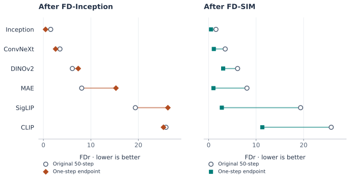

> Converting JiT into a one-step generator with FD-Inception improves FID but worsens FDr6 relative to its original 50-step results. This note examines what that disagreement shows and what it leaves unexplained.

## The idea and contributions of FD-loss

*Representation Fréchet Loss for Visual Generation* uses Fréchet distance (FD), an image evaluation measure, as a loss for post-training generators. A pretrained representation model extracts features from real and generated images, and the generator is updated to bring their feature means and covariances closer. With Inception features, this distance becomes the familiar **FID** metric. [FD-Loss, §3.1](https://arxiv.org/html/2604.28190v1#S3.SS1).

The key idea is to **separate the population size used for distribution estimation from the batch size used for backpropagation**. Features or their statistics accumulate across batches, while gradients flow only through the current batch. This makes matching distributions over a large sample population computationally manageable. [FD-Loss, §3.2](https://arxiv.org/html/2604.28190v1#S3.SS2).

The paper shows that this approach can improve existing one-step generators and convert multi-step models into one-step generators without per-sample teacher predictions. It also shows that FID and other evaluations can disagree depending on the training representation, and introduces **FDr6** to aggregate distances across several representations. [FD-Loss, §§3.3–4](https://arxiv.org/html/2604.28190v1#S3.SS3).

## Where JiT's evaluation scores disagree

JiT normally generates images through repeated denoising. Post-training with FD-loss enables generation in a single network call, but **the evaluation of that result depends on the representation used for training**. The main comparison here is between **FD-Inception**, which uses Inception alone, and **FD-SIM**, which combines SigLIP, Inception, and MAE.

FDr6 averages normalized FD values across six spaces: Inception, ConvNeXt, DINOv2, MAE, SigLIP, and CLIP. In each space, generated-to-training distance is divided by validation-to-training distance. Both FID and FDr6 are better when lower. FDr6 complements evaluation in a single representation, but it does not directly measure human preference. [FD-Loss, §3.4](https://arxiv.org/html/2604.28190v1#S3.SS4).

The following results use JiT-L/16 on ImageNet 256 × 256. The post-trained models receive 50 epochs of additional training, and evaluation uses 50,000 generated images. [FD-Loss, Table 2 and §4](https://arxiv.org/html/2604.28190v1#S4.T2).

| Generator / post-training loss | Generation | FID ↓ | FDr6 ↓ |
|:---|:---|---:|---:|
| Original JiT-L | 50-step | 2.59 | 10.73 |
| Original JiT-L | One-step | 291.59 | 214.75 |
| FD-Inception | One-step | 0.77 | 12.86 |
| FD-MAE | One-step | 6.52 | 9.30 |
| FD-SigLIP | One-step | 5.10 | 9.04 |
| FD-SigLIP + MAE | One-step | 4.67 | 3.83 |
| FD-SIM | One-step | 0.85 | 3.29 |

: JiT-L results reported in FD-Loss Table 2. The 50-step reference uses 200 network evaluations: 50 steps × 2 for the Heun solver × 2 for classifier-free guidance. Each one-step condition uses one network evaluation. {#tbl-jit-results}

The first two rows show why conversion training is needed. Simply calling the original model once produces very poor scores. FD-Inception makes a large improvement from this starting point: FID falls from 291.59 to 0.77, and FDr6 from 214.75 to 12.86.

The disagreement appears when comparing against **the original model running its full 50-step sampler**. FD-Inception has a better FID but a worse FDr6. FD-SIM has a slightly higher FID than FD-Inception and a much lower FDr6. Selecting a model by FID alone would therefore favor a different result than selecting by the broader evaluation panel.

Another detail matters: MAE or SigLIP alone also yields a lower FDr6 than the 50-step reference. The table does not support a simple explanation that conversion is impossible with a single representation. Which representation is used, and what information it supplies for this conversion, matters.

The comparison baseline needs care. The 50-step reference is a different sampling procedure, not an earlier point on the one-step training curve. Finishing with a higher FDr6 than that reference does not establish that training destroyed performance the one-step generator previously had. Some properties of the multi-step result may never have been sufficiently recovered in one step.

## What the average conceals

{#fig-representation-fdr width=780 fig-alt="Per-representation FDr for the original 50-step JiT-L, FD-Inception, and FD-SIM. FD-Inception has higher DINOv2, MAE, and SigLIP distances than the 50-step reference; FD-SIM has lower distances in all six spaces."}

The per-representation comparison in @fig-representation-fdr shows that FD-Inception's worse average does not mean uniform deterioration. Relative to the 50-step reference, DINOv2, MAE, and SigLIP distances increase, while Inception, ConvNeXt, and CLIP distances decrease. The particularly large gaps in MAE and SigLIP make the disagreement clearer than the aggregate alone.

Three of FDr6's six representations also appear in SIM's training loss, so an improved aggregate score alone cannot establish improvement outside the training representations. Here, SIM lowers all six distances, including ConvNeXt, DINOv2, and CLIP, which are outside its training set of representations. This is evidence of improvement beyond the spaces directly optimized, although those additional evaluators do not cover every visual property.

These results make the observation more specific. Inception optimization produces a generator that matches one set of feature statistics especially well, with uneven improvement elsewhere. Calling this “metric gaming” can express the concern without explaining its cause. An increase in MAE distance also cannot be translated directly into a loss of a particular property, such as shape or texture. The metric comparison needs to be read alongside the paper's visual evidence.

The paper's [Figure 5](https://arxiv.org/html/2604.28190v1#S4.F5) places outputs from the original JiT and models post-trained with different losses side by side, using the same noise inputs. In the dog example, the original one-step model's blurry output becomes a recognizable dog after post-training, while Inception and SIM also differ in background and texture. These examples provide evidence of changes visible in the images themselves. A small set of examples cannot establish which condition people prefer more often, how consistently the differences occur across the generated distribution, or what causes them.

There is also evidence about human preference. In the base-model comparison in [Figure 6](https://arxiv.org/html/2604.28190v1#S4.F6), models post-trained with FD-SIM are preferred. However, this evaluates **FD-SIM against the corresponding base models**; it does not directly test the Inception–SIM difference in JiT.

::: {.callout-note collapse="true" title="Exact values and figure source"}

| Representation | Original 50-step | FD-Inception | FD-SIM |
|:---|---:|---:|---:|
| Inception | 1.54 | 0.46 | 0.51 |
| ConvNeXt | 3.49 | 2.57 | 1.09 |
| DINOv2 | 6.10 | 7.34 | 3.06 |
| MAE | 8.07 | 15.28 | 1.01 |
| SigLIP | 19.37 | 26.22 | 2.78 |
| CLIP | 25.82 | 25.29 | 11.30 |

Source: [FD-Loss v1, Table F.4](https://arxiv.org/html/2604.28190v1#A6.T4). The paper uses SigLIP2 and labels it SigLIP in the tables; the figure preserves that label. Download the [transcribed CSV](assets/jit-fd-loss/table-f4.csv) and [plotting script](assets/jit-fd-loss/plot-fdr.py).

:::

## Could the starting model matter?

FD-Loss also post-trains pMF and iMF, which already generate in one step. In its separate 100-epoch comparison, Inception post-training improves their FDr6, while JiT remains worse than its original multi-step reference on that metric. [FD-Loss, Table 3](https://arxiv.org/html/2604.28190v1#S4.T3).

This contrast connects to the authors' suggestion that converting a denoiser is harder than improving an existing one-step generator. [FD-Loss, §4.3](https://arxiv.org/html/2604.28190v1#S4.SS3). In multi-step generation, an intermediate prediction is used to update the current sample; in one-step generation, a single output must be the final image. A representation that supplies useful corrections to a function already producing complete samples may be insufficient to teach a denoiser to perform the entire process in one call.

That explanation is plausible, but the comparison changes more than the starting ability. The model families differ in architecture and training history, and JiT uses a different post-training learning rate. Their results cannot isolate conversion difficulty as the cause. What they show is that the same loss can behave differently across settings.

The remaining question is therefore: **does Inception fail to teach some properties needed for conversion, or can optimizing it also undo those properties once they are present?**

## What remains unexplained

The first possibility is an incomplete learning signal. Inception statistics may become easy to match before the generator learns everything needed to satisfy the other representations. In this case, the gap concerns what conversion has yet to achieve.

The second possibility is a conflict between objectives. A change that brings Inception features closer to the real-data reference can move another representation's features farther away. Reducing distance in one space provides no mathematical guarantee of improvement in another. This could also affect a generator that already produces good one-step samples.

Optimization offers another explanation. The paper normalizes each FD term, but this does not equalize the magnitudes and directions of parameter gradients. Differences in the actual updates induced by the losses therefore remain a possible explanation. [FD-Loss, §3.2 and Eq. 6](https://arxiv.org/html/2604.28190v1#S3.SS2). Accumulated feature statistics may also reflect earlier generator states. These training dynamics could partly account for a difference attributed to the representation. The published endpoints do not distinguish these explanations, and identifying which metric improved does not establish the cause.

A useful follow-up would compare Inception refinement from an already good one-step JiT with conversion from the original denoiser. With continued SIM training as a control, learning curves could help distinguish distances that never recover from distances that improve and later reverse. This is the kind of evidence missing from the current tables.

The central lesson for reading the paper is concrete. FD-loss gives a representation model a role in both evaluating and teaching the generator. JiT shows why those roles deserve separate scrutiny. Success in the training representation need not translate into even improvement elsewhere, and the learning signal required of that representation changes when the generator must learn a new way to produce images.

---

*Source scope:* This note analyzes the JiT results reported in FD-Loss `2604.28190v1`. All numerical results come from the paper, and the figure replots those values. The possible causes discussed here are interpretations, not findings established by new experiments.
